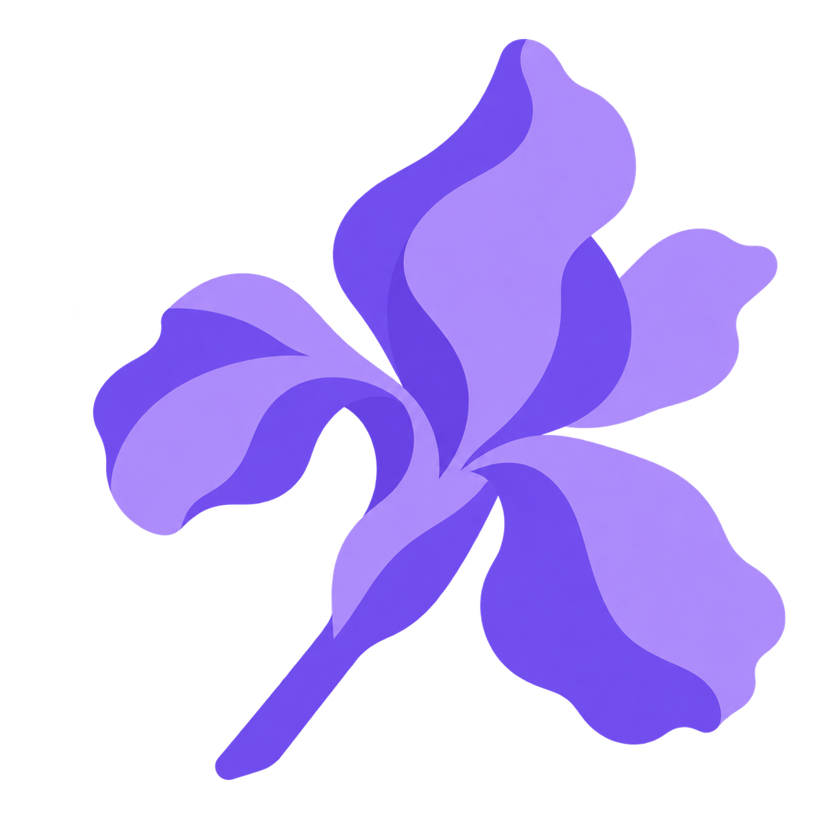
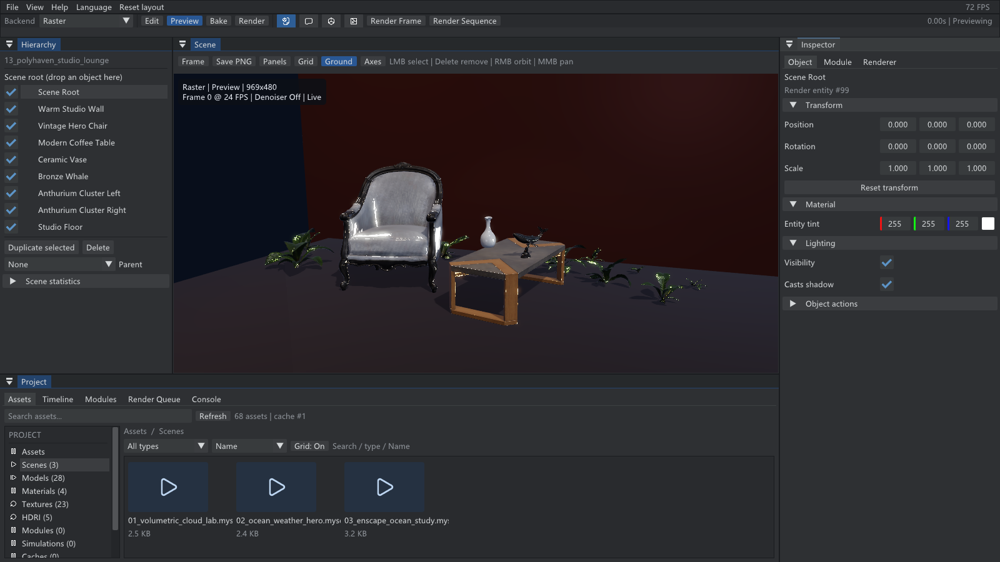
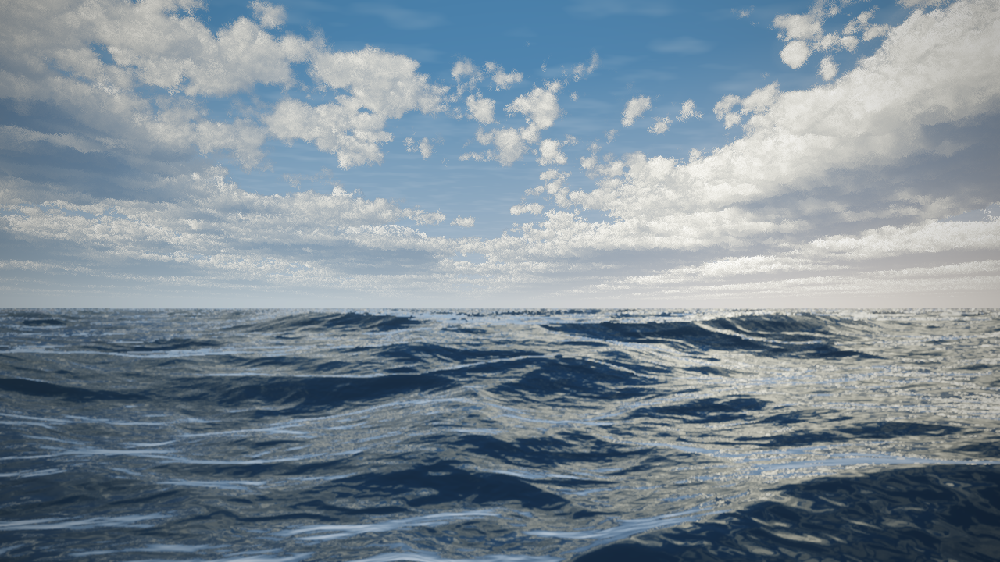
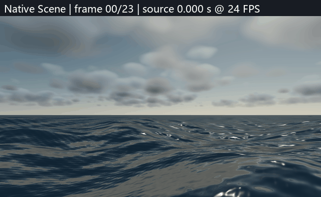
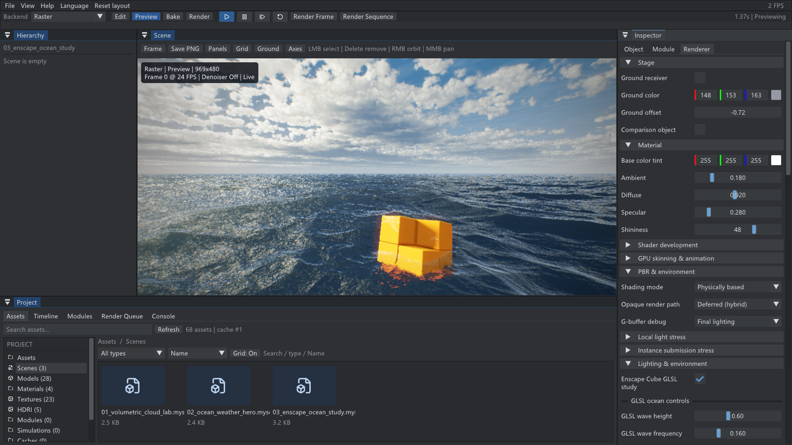
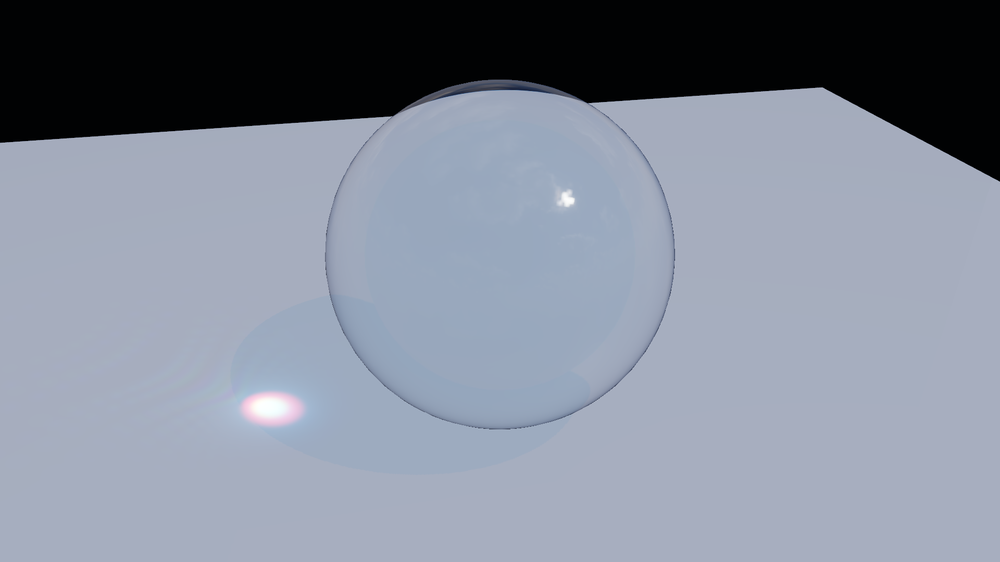
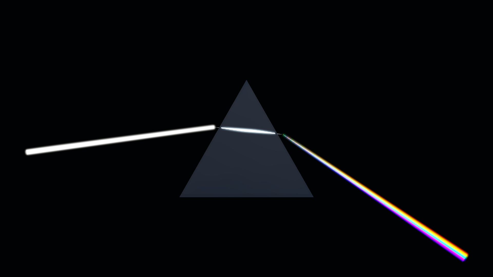
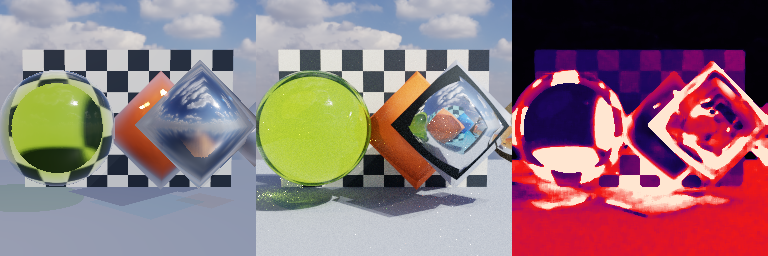

<p align="center">
  
</p>

<h1 align="center">Iris</h1>

当前研发转向可扩展引擎架构，暂停场景画质扩展；计划和验证状态见 [插件架构路线](ARCHITECTURE_ROADMAP.md)。实验分支不自动合并 `main`。现有图像与场景保留作展示和迁移回归输入。

<p align="center">A C++17 real-time and offline rendering playground.</p>

<p align="center">
  <a href="#快速开始">快速开始</a> ·
  <a href="#主要能力">主要能力</a> ·
  <a href="#构建与测试">构建与测试</a>
</p>

Iris 是一个独立的图形学与渲染实验平台，将实时光栅化、CPU 路径追踪、场景编辑和批量渲染放在同一套工作流中。

项目源于我在西安交通大学图形学课程框架 [Dandelion](https://github.com/XJTU-Graphics/dandelion) 中的学习经历。Iris（鸢尾花）延续植物命名，也呼应视觉、成像与光谱的探索。



*1600×900 工作区：Hierarchy 显示 9 个实体，Scene 预览室内模型，Inspector 展示 Object 属性，Project 浏览内置场景。[截图复现](assets/readme/README.md)*



*GLSL：Thomas / @Thomas_ensc（Enscape Cube），海面：Alexander Alekseev / TDM（Seascape）；CC BY-NC-SA 3.0，见第三方许可目录。*

*M2-D 固定海面机位，1280×720：原生 Gerstner 海面、多尺度短波法线、体积云和有限云反射。该画面来自 Iris Raster，不是独立研究 Shader 或 CPU PT。[来源与复现](assets/readme/README.md)*

## 主要能力

- **实时渲染**：OpenGL 3.3、PBR / IBL、Forward / Hybrid Deferred、阴影、SSAO、TAA 与 Toon 风格。
- **离线渲染**：CPU 渐进式路径追踪、BVH / BLAS-TLAS、MIS、自适应采样、AOV，以及 PNG / HDR / EXR 输出。
- **光与自然场景**：棱镜光谱、色散、玻璃与焦散，解析大气、体积云和海面。
- **场景与资产**：OBJ、DAE、glTF / GLB 导入，场景层级、材质编辑、骨骼动画及资源浏览。
- **统一工作流**：共享 Scene / Camera、Timeline、可复现的 C++ 模块、Render Job 与持久化 Render Queue。

<details>
<summary>更多预览：海面与光照实验</summary>



*24 个源帧按 24 FPS / Seed 20261006 输出；GIF 为放慢并在三个构图停留的展示版，不用于证明实时帧率。*



*1600×900 工作区，Inspector 的 Renderer 页展示材质、PBR 与光照参数；Scene 显示程序化海面、天空和黄色方块。[截图复现](assets/readme/README.md)*



*当前 Glass3 固定机位、4× MSAA；与关闭焦散、Projector 和 Debug 的对照由 Glass3 回归覆盖。*



*Prism5 固定输入，21 个波长采样；关闭色散与七色模式分别保留为回归对照。*



*256×256、512 SPP、Depth 8、Seed 20260915；差异图用于说明两条算法路径的边界，不要求像素一致。[来源与复现](assets/readme/README.md)*

</details>

## 快速开始

推荐使用 Windows、Visual Studio 2022 和支持 OpenGL 3.3 的显卡；另需 CMake 3.20+、Git 和 Python 3。首次配置会下载锁定版本的依赖。

```powershell
git clone https://github.com/Azar233/Iris.git
cd Iris
python -m pip install "Jinja2>=2.7,<4.0"
cmake -S . -B build -G "Visual Studio 17 2022" -A x64 -T host=x64
cmake --build build --config Release --parallel
.\build\Release\Iris.exe
```

启动后，通过 `File > Open bundled scene` 打开体积云、海面或光照实验场景。右键拖动旋转相机，中键平移，滚轮缩放；点击视口后可用 `W/A/S/D` 移动。

当前作品入口为 `01_ocean_clouds_hero`（GLSL 云海，默认隐藏研究方块）与 `03_enscape_ocean_study`（保留方块的原研究场景）。01 直接复用 03 的四 Pass GLSL 和海面参数，持续实时播放，右键旋转、中键平移、滚轮缩放。右侧 Renderer → Lighting & environment 的 GLSL 控件调节波高、频率、波形、速度、云量、反射、太阳、曝光和方块显示；普通 Water surface / Cloud layer 参数在此模式下禁用。

右侧“稳定反射 / 减少噪点”默认在 01 开启，抑制近景彩色颗粒与尖锐高光；03 默认关闭以保留原研究效果。多方向云反射和局部水面像素过滤会增加 GPU 开销，并使细小亮点略柔和。RTX 4060 Laptop、1280×720 默认实时连续 600 帧的 GPU P95 为 7.45 ms；这是本机测量，不代表所有硬件。

GLSL 海面来自 Thomas / @Thomas_ensc 的 Enscape Cube，海面过程署名 Alexander Alekseev / TDM 的 Seascape；对应 GLSL、适配修改与展示图保留 CC BY-NC-SA 3.0 许可，见 `shaders/third_party/enscape_cube/LICENSE.md`。这条路径的程序波面不等于原生 CPU/GPU 水面查询，也不替代原生云层的验收。

原生云海保留在 `assets/scenes/fixtures/28_native_ocean_clouds.myscene`，`06_ocean_clouds_hero.renderjob` 继续验证原生昼夜序列；新 `07_glsl_ocean_clouds.renderjob` 输出 0～23 帧 / 24 FPS 的 GLSL 海浪短序列。24 帧只限定导出任务，实时浏览不受此限制。旧 Cloud Lab 与 Ocean Weather Hero 可见入口已移除。原生天空 CPU 重建并行优化与自然场景合同继续保留。

```powershell
.\build\Release\Iris.exe assets/scenes/01_ocean_clouds_hero.myscene
.\build\Release\Iris.exe raster-sequence assets/renderjobs/07_glsl_ocean_clouds.renderjob --output "output/hero/frame_{frame:04}"
```

### 使用 Windows Release ZIP

将 `Iris-0.1.0-Windows-x64-M2D.zip` 解压到可写目录，在含 `Iris.exe` 的目录运行以下命令。ZIP 包含 shader、示例资产、Job、许可文件和 MSVC Release 运行库；运行时不需要源码、CMake、Python 或联网下载。

最低功能要求为 Windows x64、支持 OpenGL 3.3 Core 的显卡与驱动；本次验收使用 Windows 11、RTX 4060 Laptop 和 NVIDIA 591.44。更低性能硬件尚未实测，云海 High 与 CPU PT 的速度取决于硬件。CPU Batch 不创建 OpenGL 上下文，编辑器与 Raster 输出需要图形驱动。

```powershell
.\Iris.exe assets/scenes/fixtures/26_module_workflow.myscene
.\IrisBatch.exe render-sequence assets/renderjobs/01_cpu_reference.renderjob --output "output/cpu/frame_{frame:04}"
.\Iris.exe raster-sequence assets/renderjobs/04_coastal_sequence.renderjob --output "output/coastal/frame_{frame:04}"
```

示例 Job 保留源码工作流的默认输出路径；解压包推荐使用 `--output` 指定结果目录。CPU 示例输出 2 帧及 AOV，海面示例输出 13 帧 Beauty PNG；格式、缓存和 Queue 边界见下方支持矩阵。Vulkan/GPU PT、PhysX 和曲面细分尚未实现；CPU PT 尚未完整支持原生水面与空中透视，原生云海已完成云形与高度照明切片，海面与整幅作品的最终视觉定稿仍在后续阶段。

批量渲染与验证：

```powershell
.\build\Release\IrisBatch.exe render-sequence assets/renderjobs/01_cpu_reference.renderjob
ctest --test-dir build -C Release --output-on-failure
```

## 工作流与 Job 支持范围

File 菜单、快捷键与资源浏览器通过共享命令执行新建、保存、场景打开与模型导入；窗口可直接接收 `.myscene`、`.renderjob` 和模型文件拖放。View 菜单的五个展示 Preset 打开对应的完整场景。CPU Settings 的设置变化取消旧任务；暂停时 Restart 重算当前帧并保持暂停。

| 能力 | CPU Job / IrisBatch / GUI Queue | Raster Job / Iris raster-sequence |
| --- | --- | --- |
| 格式 | PNG、Radiance HDR、OpenEXR，可组合 | Beauty PNG |
| AOV | Beauty、Albedo、Normal、Depth、Direct、Indirect、Sample Count、Variance | Beauty |
| Resume | 按已验证输出报告恢复完整帧 | 不支持，执行前拒绝 |
| Simulation Cache | 显式配置 Module 的 Job；Hit/Missing/Stale 均有诊断 | 不支持，执行前拒绝 |
| GUI Queue | 支持提交、取消、重试与恢复 | 入队及重试时拒绝，使用 CLI |
| Module 参数 | `.renderjob.module` 明确定义并优先于 Scene 配置 | `.renderjob.module` 明确定义 |

`.myscene.module` 用于编辑器保存和恢复。CPU Batch 不自动继承这份模块配置：带 Module 的 Scene 必须搭配显式配置 Module 的 Job，避免保存配置被静默忽略。Scene 保存的是参数与 Seed，执行范围和 FPS 由 Timeline / Job 明确定义；示例采用 0～23 帧、24 FPS。

固定示例：[模块场景](assets/scenes/fixtures/26_module_workflow.myscene)与[对应 Job](assets/renderjobs/05_module_workflow.renderjob)，使用 Turntable、22.5 度/帧、Z 轴和 Seed 20260919。可在 GUI 保存重开并预览，再由 Batch 输出；自动验收核对两者的第 12 帧图像、参数、FPS、Seed、API 与 Build ID。

```powershell
.\build\Release\Iris.exe assets/scenes/fixtures/26_module_workflow.myscene
.\build\Release\IrisBatch.exe render-frame assets/renderjobs/05_module_workflow.renderjob 12
cmake --build build --config Release --target workflow-acceptance
```

## 构建与测试

MinGW 用户可将配置命令改为 `cmake -S . -B build-mingw -G "MinGW Makefiles" -DCMAKE_BUILD_TYPE=Release`，然后运行 `cmake --build build-mingw --parallel`。

以下目标分别验证真实 OpenGL 启动、运行固定图回归和生成可独立运行的 ZIP：

```powershell
cmake --build build --config Release --target gpu-smoke
cmake --build build --config Release --target renderer-regression-suite
cmake --build build --config Release --target package
```

## 项目结构

```text
src/       编辑器、场景、实时渲染、路径追踪、光学与运行时
shaders/   GLSL 渲染与后处理
assets/    模型、场景、环境、图标与 Render Job
tests/     自动化测试
tools/     资产生成、验收、截图与性能工具
```

Iris 仍在持续开发，实时与离线路径的支持范围并不完全相同。内部 CMake target（`MyRenderer`、`MyRendererBatch`）、`MYRENDERER_*` 环境变量和持久化标识保留旧名称，以兼容已有项目。

## 许可与致谢

项目采用 [MIT License](LICENSE)。感谢 Dandelion 提供最初的图形学学习土壤，以及 GLFW、GLAD、GLM、Dear ImGui、Assimp 等开源项目；第三方代码和资产的许可分别见[依赖声明](THIRD_PARTY_NOTICES.md)与[资产来源](ASSET_LICENSES.md)。
