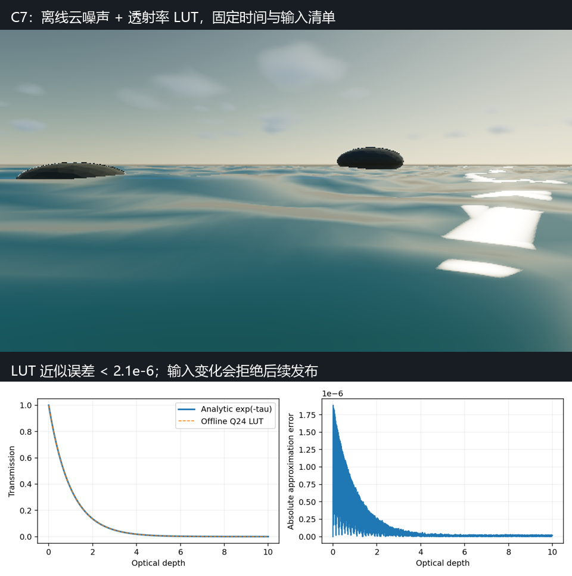

# P1-A C7：离线 Lighting LUT 与捕获输入合同收口

> 日期：2026-09-28。源码：`c41e8dd` 基础上的当前工作区，尚未提交。
> 构建：`build-ci-msvc` Release、`build-mingw` Debug。
> GPU：NVIDIA GeForce RTX 4060 Laptop GPU；OpenGL 3.3.0 NVIDIA 591.44。

## 目标与范围

在已完成的确定性控制和离线云密度基础上，补齐可验证的 lighting LUT（光照查找表）与捕获输入 manifest（依赖清单）。本步完成 C7 的可重复捕获合同。写实云形、多重散射的物理精度以及海洋光学仍按 C2/C3/C5 和海洋路线继续推进。

## 实现：资产、运行时、渲染与报告

### 离线透射率

CPU 工具 `MyRendererCloudLightingAsset` 生成 `transport-v1.cloudlut`：8,193 个端点样本覆盖光学深度 `[0,32]`，步长为 `1/256`，使用 Q24 定点整数和小端编码。文件为 32,800 B，版本和准确长度、单调性、范围、内容指纹均在加载时校验。资产内部 FNV-1a 64 指纹为 `36a2741b31f43904`；MSVC 与 MinGW 独立生成文件的 SHA256 均为 `73812087724709247305e0eb8486303db4804c3ec0c362f868898ca056ec2c28`。

`cloudOfflineNoise=true` 同时启用离线密度与透射率来源，旧场景关闭时继续使用程序化密度和解析 `exp`。Scene 加载与 Inspector 应用先验证两种资产，再提交设置；来源切换沿用已有云历史失效规则。表用于可见云的直射、散射填充、步进衰减以及太阳云影；CPU Reference 使用同一份不可变数据和显式线性插值。相位函数和现有 octave 填充保持原模型，本表不是完整的多重散射解。

GPU 在上下文线程首次上传到 `129×64` 的 R32F atlas（33,024 B/副本），两个纹素显式插值，不依赖硬件过滤精度。可见云和云影各持有一份，首次上传后不再逐帧读取或计算文件哈希。上传恢复 active texture、texture binding、PBO 和 unpack 对齐/步长/偏移/字节序。深度超过 32 时采用解析尾部；域内小于 Q24 半个量化单位的能量可能舍入为零，误差按绝对值验收。

### 实际消费的输入清单

Raster sequence 启用作用域内的依赖跟踪，编辑器和普通导入不做额外哈希。清单记录 `.renderjob` 原始解析内容、`.myscene`、OBJ 与实际读取的 MTL、Assimp 实际打开的 glTF/GLB/DAE 及外部 buffer、外部纹理与缺失纹理状态、HDR/EXR、编译的 shader 和递归 include、离线噪声/LUT、可执行文件和 Windows 系统目录之外已加载的 DLL。内嵌 buffer/贴图由容器文件指纹覆盖；内建模型和静态 Module 实现由可执行文件覆盖。

输入在消费前记录，重复消费时比较；每帧绘制前及报告写入前重新校验。检测不依赖 mtime，能拒绝同大小、同时间戳的内容修改，以及删除或缺失资源出现。报告记录规范化绝对路径、存在状态、字节数和整个文件的 FNV-1a 64 指纹。资源内部指纹与整个文件指纹覆盖范围不同，不能直接混作同一值。当前海洋固定捕获记录 49 项输入，包括初始化时加载的 EXR 与未实际绘制但已经编译的 shader，属于实际消费输入的保守集合。

帧报告新增 `inputManifest` 与 `lightingTransportSource`，`offlineAssets` 同时列出噪声与 LUT 的实际内存身份。报告校验失败时删除本帧 staging PNG/JSON，并停止序列，已成功输出的先前帧保留。作者设置、固定时间预热、history reset、GPU/驱动和 Module seed 的原有字段继续保留。

## 截图

下图上半部分来自固定时间、离线资产与完整输入清单的真实海洋捕获；下半部分展示 LUT 与解析透射率的重合及近似误差。画面仍属于当前海洋/云形实现，不能作为达到写实参考风格的证据。



复现：运行 `cloud-determinism-acceptance`，随后 `python tools/CloudCaptureIllustration.py`。该图位于 `docs/media`，本次没有修改历史回归基线。

## 验证

- `cloud-capture-inputs`：100,001 个 CPU 深度点的最大 LUT 误差为 `1.90735e-6`，阈值 `2.1e-6`；错误指纹、尾随字节、同大小/时间戳修改、删除和缺失资源出现均被拒绝。
- 两个编译器的 `MyRendererCloudNoiseGpuTests` 均通过：LUT CPU/GPU 最大绝对误差 `2.98023e-8`，GPU 相对解析最大误差 `1.90735e-6`；非默认 PBO/unpack/active 状态上传验收通过。原六组噪声采样仍通过。
- `asset-import`：真实 OBJ MTL 和 glTF 外部 BIN 被纳入清单；`raster-capture-contract`：依赖变化拒绝报告写入。
- `cloud-capture-mutation-acceptance`：首帧成功后修改构建目录中的模型副本，后续捕获因 `Capture input changed` 停止，原模型 SHA256 不变。
- `cloud-determinism-acceptance`：15 组 PNG/报告，固定采样重复、0/5 帧预热不变性、时间积累重复性与实际噪声/LUT/输入清单均通过。
- `cloud-offline-production-acceptance`：两个场景 × Low/High × 两种来源的 8 组图像通过；离线云 CPU/GPU 最大透射率误差 `0.000511169`、最大 radiance 绝对误差 `0.015709`；云影 Low/High 最大误差 `0.000481725/0.000487387`。
- `gpu-smoke`、1100×680 缩略图布局通过；Viewport 为 538×322，实际上传 2 个缩略图。移动相机验收两个场景各只重建 1 次天空，MSVC CPU P50/P95 为 Lab `9.611/10.274 ms`、Ocean `8.008/26.797 ms`。
- MSVC Release 完整 CTest `26/26`，MinGW Debug 的新增捕获合同 focused CTest `2/2` 通过。

1280×720、Hybrid Deferred、4×MSAA、半分辨率云、固定时间、关闭 history/TAA/bloom 的本次完整 GPU P50：

| 场景 | 档位 | 程序化密度/解析透射率 | 离线密度/LUT |
| --- | --- | ---: | ---: |
| Cloud Lab | Low | 5.604 ms | 3.297 ms |
| Cloud Lab | High | 14.662 ms | 7.226 ms |
| Ocean Hero | Low | 5.071 ms | 3.271 ms |
| Ocean Hero | High | 12.315 ms | 6.596 ms |

以上对比同时切换密度来源与 LUT，性能差主要来自已完成的噪声优化，不能解读为 LUT 独立提速。编辑器默认时间积累与 VSync 的 FPS 不由此表推算。

## 限制与取舍

- FNV 是内容身份校验，不是安全哈希。manifest 不打包依赖，不提供恢复/resume；它用于核对同一资源与构建，绝对路径在迁移时需映射。
- 校验边界之间存在文件系统竞态窗口；没有对外部编辑加锁或持有全部资源的不可变磁盘快照。捕获期间输入应保持稳定，已观察到的变化会拒绝后续发布。
- PNG/JSON 两次 rename 仍不具备跨文件原子发布和断电恢复。GPU/驱动属于报告中的运行环境；没有承诺跨 GPU 厂商逐像素一致。
- 二进制/DLL 枚举验收针对 Windows；其他平台的 `complete` 为 false，没有本阶段的完整运行库清单验收。
- LUT 只替代 Beer–Lambert transport，不提供更高阶散射、物理日月星历或新的海洋焦散算法。写实观感仍有后续工作。

## 复现命令

```powershell
cmake --build build-ci-msvc --config Release --parallel 6
ctest --test-dir build-ci-msvc -C Release --output-on-failure
cmake --build build-ci-msvc --config Release --target cloud-determinism-acceptance
cmake --build build-ci-msvc --config Release --target cloud-capture-mutation-acceptance
cmake --build build-ci-msvc --config Release --target cloud-offline-production-acceptance
build-ci-msvc/Release/MyRendererCloudNoiseGpuTests.exe build-ci-msvc/cloud-c7-noise-gpu
build-ci-msvc/Release/MyRendererCloudLightingAsset.exe verify assets/clouds/transport-v1.cloudlut
# generate 拒绝覆盖已有输出。
build-ci-msvc/Release/MyRendererCloudLightingAsset.exe generate build-ci-msvc/transport-new.cloudlut
python tools/CloudCaptureIllustration.py
```

## 下一步

C7 捕获合同完成。继续 [`todolist.md`](../todolist.md) 的 C3 光照对照标定与 C5 authored weather/云形资产，再推进日月星历和海洋写实光学。
