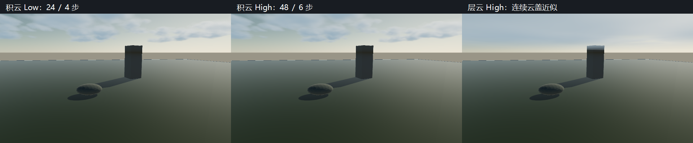

# P1-A 切片 6：三维云场标定与性能验收

- 日期：2026-09-28
- 源码 revision：`c41e8dd` 加当前工作区改动，尚未提交
- 构建：`build-ci-msvc`，MSVC Release；`build-mingw`，MinGW Debug
- GPU / 驱动 / OpenGL：NVIDIA GeForce RTX 4060 Laptop GPU / NVIDIA 591.44 / OpenGL 3.3.0

## 目标与范围

三维 Worley 修复后的密度场需要重新测量。旧二维场的消光、云型覆盖率和边缘指标不能作为新字段的验收证据。本阶段固定消光系数 `0.0025`，重新标定积云与层云覆盖参数，验证 Low/High 是否仍积分同一云场，并测量全分辨率成本，作为 C4 优化的对照。

本阶段完成的是形态与结构验收。光照观感仍偏柔，尚未达到参考图的写实积云；半分辨率和时间历史尚未实现。

## 实现

### 云型参数与共享模型

`applyCloudPreset()` 的积云 `cloudCoverage` 从 `0.50` 调到 `0.60`，层云从 `0.70` 调到 `0.95`。消光、密度、weather map 和风场不随 Low/High 改变，只有积分预算分别为 `24/4` 与 `48/6` 步。Inspector、CPU 参考和 GPU 仍使用同一预设函数。

场景中已有的显式参数保留原值。加载默认场景不会自动套用新预设；在云层 Inspector 中选择预设时才会应用，验收截图通过 `MYRENDERER_CLOUD_PRESET` 应用。

### 可靠的密度与剪影测量

`MyRendererCloudCalibration --acceptance OUTPUT_DIRECTORY` 在固定 `96×64` 网格测量三个预设。相机位置为 `(0,1.1,0)`，仰角为 `15～55°`，方位角为 `-1.2～1.2 rad`。该视野专门观察云层，不等于编辑器截图的视野。

原工具只取每条光路的云层中点，容易漏掉三维云体。现在 `meanDensity` 使用每条完整 slab 光路的独立 `64` 点中点积分；它是平均无量纲密度，不是平均光学厚度，不能直接乘云层垂直厚度推导斜视线透射率。该指标不依赖质量档，也不受 march 提前退出影响。

剪影定义为 `T < 0.5`。`edgeDensity` 是边界覆盖像素数除以覆盖像素数，包含画框边界；只在同一 `96×64` 分辨率与机位下比较。Low/High 额外逐像素比较透射率 MAE（平均绝对误差）与 silhouette IoU（剪影交并比）。输出包含 JSON 与六张透射率 PPM，亮色代表透射，暗色代表遮挡。

### 编辑器与 GPU 诊断

云 march 从 tone map 回调中移到独立 `Cloud volume march`，通过 `RenderPassContext` 声明输入、输出、视口和深度状态，复用已有异步 GPU 时间戳。合成仍在 tone mapping 前，关闭云时跳过该 pass。

原 `CloudLayerRenderer` 每帧调用 `glGetTexImage` 下载全分辨率诊断图，再在 CPU 遍历求最大样本数。这会强制等待 GPU，且在交互帧中没有必要。现在只有测试传入 `collectDiagnostics=true` 才做同步回读；默认绘制返回诊断计数 `0`。GPU parity 测试保留显式回读，并检查生产绘制不会保留过期诊断值。

## 截图



图：三个截图来自同一 `960×540` 机位。积云两档保留相同大尺度分布，Low 的积分噪声更明显；层云表现为连续、对比度较低的云盖。图中软边与较平的照明也说明写实光照尚未完成。通过 `cloud-layer-acceptance` 生成，再将 `cumulus_low.png`、`cumulus_high.png`、`stratus_high.png` 缩放为 `640×360` 横向拼接并加标题。

## 验证

### 固定云场的形态与档位一致性

`cloud-shape-acceptance` 在 MSVC Release 与 MinGW Debug 均通过。以下为 MSVC 的测量值；覆盖率以整个诊断视野为分母。

| 预设 | Low / High 覆盖率 | Low 边缘密度 | Low 连通块数 | Low/High 透射率 MAE | 剪影 IoU |
| --- | --- | --- | --- | --- | --- |
| 积云 | 30.729% / 30.745% | 0.1605 | 11 | 0.004079 | 98.580% |
| 层云 | 88.737% / 88.981% | 0.0567 | 1 | 0.000957 | 99.434% |
| 卷云近似 | 0.260% / 0.228% | 0.6875 | 1 | 0.000196 | 87.500% |

积云的平均密度为 `0.0298235`，层云为 `0.165082`，卷云为 `0.00132977`。积云修正前覆盖率为 `16.732%`，层云修正前为 `18.571%`；参数重新标定后符合疏散积云与连续层云的区别。

门槛：积云覆盖率 `20～70%`、至少两个连通块、最大块占比 `<90%`、边缘密度 `0.1～0.3`；层云覆盖率 `>70%`、边缘密度 `<0.15`；卷云平均密度非零且半不透明覆盖率 `<10%`。所有档位透射率 MAE `<0.03`，剪影 IoU `>90%`；对于几乎透明的字段，还允许剪影差异少于总像素的 `0.2%`。卷云只有 `16/14` 个半不透明像素，差异为 `2/6144`（`0.0326%`），因此 IoU 的低值不表示大面积结构变化。

`cloud-layer-acceptance` 检查相同 GPU 上的 High 重复截图逐像素一致，并确认云 On/Off 会改变画面。Low/High 的数值验收使用上述 CPU 透射率图，GPU 截图用于检查最终照明与合成，不用宽松的整图阈值替代形态合同。

### 全分辨率成本

`cloud-layer-benchmark` 固定 `01_volumetric_cloud_lab.myscene`、1280×720、Hybrid Deferred、4×MSAA，关闭几何 TAA 和 bloom。预热 `16` 帧，测量 `60` 帧。每个档位在独立进程运行，云关闭时验证不存在云 pass 时间项。

| 档位 | 云 pass GPU P50 / P95 | 整帧 GPU P50 / P95 |
| --- | --- | --- |
| Off | 跳过 | 1.887 / 2.142 ms |
| Low | 11.350 / 12.041 ms | 12.601 / 13.897 ms |
| High | 25.363 / 26.449 ms | 27.044 / 28.318 ms |

这组数据证明全分辨率三维程序化采样成本偏高。它是当前硬件上的 C4 优化对照，不是其他 GPU 的通用帧率承诺。benchmark 要求足够的有效计时样本，尚未设未经验证的性能上限。

MSVC 全量 CTest `23/23`；MinGW 云场、大气、形态验收 `3/3`。`cloud-march-parity` 与 `gpu-smoke` 的运行结果记录在构建目录日志中。版本化回归基线没有改写。

## 限制与取舍

当前场仍为共享程序化 3D Worley，未上传离线 3D 噪声纹理。weather map 为共享程序化字段，外部 authored weather map 导入未实现。卷云仍使用 slab 近似；本阶段验收只证明薄云的积分稳定，不证明纤维状卷云的真实性。

当前截图仍缺少参考图中的硬朗积云边缘、细节层次与强烈体积光照。单层云场也没有云影和 god rays。不能以本阶段数据把 C1～C7 整体标为完成。

## 复现命令

```powershell
cmake --build build-ci-msvc --config Release --target MyRendererCloudCalibration
ctest --test-dir build-ci-msvc -C Release -R cloud-shape-acceptance --output-on-failure
build-ci-msvc/Release/MyRendererCloudCalibration.exe --preset-sweep
cmake --build build-ci-msvc --config Release --target cloud-layer-acceptance
cmake --build build-ci-msvc --config Release --target cloud-layer-benchmark
```

形态报告位于 `build-ci-msvc/cloud-calibration/shape.json`；截图位于 `cloud-layer-acceptance/`；GPU 报告位于 `cloud-layer-benchmark/{off,low,high}.json`。

## 下一步

本阶段后的 C4 已完成，性能与时间稳定性对照见 [`cloud-temporal.md`](cloud-temporal.md)。以下保留本阶段结束时的工作目标。

继续 [`todolist.md`](../todolist.md) 的 C4：半分辨率云 radiance/transmittance 与首个有效密度深度、深度引导升采样、风场体积运动及独立时间历史。验收应与本阶段全分辨率成本比较，并覆盖静止视角闪烁、移动相机残影、视口尺寸变化、云参数改变与关闭重开后的历史失效。
