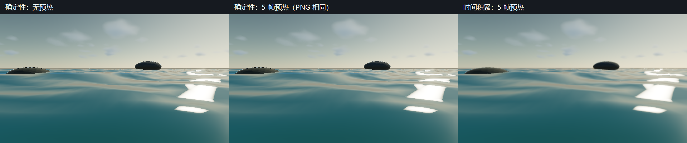

# P1-A C7：确定性捕获与 Render Job 元数据

> 日期：2026-09-28。源码：`c41e8dd` 基础上的当前工作区，尚未提交。
> 构建：`build-ci-msvc` Release、`build-mingw` Debug。
> GPU：NVIDIA GeForce RTX 4060 Laptop GPU；OpenGL 3.3.0 NVIDIA 591.44。

> 后续状态：C7 的离线 Beer–Lambert LUT 与 Windows 捕获输入清单已完成，见 [`cloud-c7-contract.md`](cloud-c7-contract.md)。本文的未完成项描述保留为该切片完成时的范围记录。

## 目标与范围

本步把云渲染的采样策略、固定时间预热和输出报告变成正式捕获合同，避免截图依赖先前的编辑器绘制历史。离线 3D 噪声的生成、上传和指纹校验基础已完成独立验收，见 [`cloud-noise-assets.md`](cloud-noise-assets.md)；生产密度场已接入（见 [`cloud-offline-runtime.md`](cloud-offline-runtime.md)），LUT 与完整 manifest 尚未接入，C7 总项仍保持未完成。

## 实现：声明、有效设置与发布

`.myscene` 新增 `cloudDeterministic`，旧场景缺字段时为 false。设置经编辑器快照、领域命令和场景应用进入大气参数；Inspector 提供“确定性云渲染”，交互入口可用 `MYRENDERER_DETERMINISM=1` 覆盖。

`Renderer::render` 从作者设置建立本帧有效副本。确定性模式关闭云历史、几何 TAA 和 shader hot reload（着色器热重载）；云 march 使用现有固定像素坐标的采样抖动，步数仍为固定质量档位，没有自适应步数。原始 TAA/云历史偏好保留，退出模式后可以恢复。确定性设置本身不冻结时间：交互编辑器仍可播放动画，比较截图时还需要固定场景时间、相机和参数。

### Render Job schema 3

Schema 3 的 raster 作业必须显式填写：

```json
"raster": {
  "determinism": true,
  "warmupFrames": 0,
  "temporalAccumulation": false
}
```

| 字段 | 合同 |
| --- | --- |
| `determinism` | 关闭时间积累，固定云采样，并禁用热重载 |
| `warmupFrames` | 每个输出时间先预热 0～240 帧，再绘制 1 帧用于输出 |
| `temporalAccumulation` | 同时控制捕获用的 TAA 与云历史；与 determinism=true 互斥 |

Schema 1/2 继续读取，raster 捕获默认确定性、零预热、无时间积累。Schema 1/2 携带新 `raster` 控制段会被拒绝，CPU 作业也不能携带它；schema 3 CPU 作业沿用原有 CPU 合同。缺字段、错误类型、负数/过大/小数预热以及确定性与历史同时开启都会拒绝，失败加载不会覆盖此前有效作业。

作业逐帧推进 Module 或 water time，但一个输出帧的全部预热绘制共用同一场景、相机、参数和时间。每个输出先调用 `invalidateTemporalHistory`，同时重置 TAA 抖动序列和云历史；历史只在该输出帧内部积累，不从前一个输出继承。非确定性作业也关闭热重载，避免捕获过程中程序发生变化。

### PNG 与报告

每个 beauty PNG 同时输出 `frame_NNNN-report.json`，格式为 `MyRendererRasterFrameReport` schema 1。报告记录：GPU/驱动、分辨率、帧与请求时间、Module/采样 Seed、预热次数、固定时间绘制次数、请求与有效历史开关、云抖动策略、质量档位、云高度/覆盖率/密度/风偏移和太阳参数。

报告还记录原始 `.myscene` 与 `.renderjob` 的 `FNV-1a 64` 内容指纹（非安全哈希）。它们不覆盖模型、贴图或 shader 内容，也不是完整的输出恢复 manifest；运行时输入文件应保持不变。复现仍需要对应场景、作业、资源和构建，不能只靠报告重建画面。

报告按实际模式记录来源；程序化模式写为 `procedural-shared-field` 且 `offlineAssets` 为空，离线模式写为 `offline-rgba16-shared-field` 并列出实际资源/版本/指纹，见 [`cloud-offline-runtime.md`](cloud-offline-runtime.md)。PNG 与报告先分别完成 staging 写入，再发布；已有 PNG 或报告会拒绝覆盖。两文件 rename 并非一个原子事务，崩溃可能留下 staging 文件或不完整文件对，下一次不会静默 resume。

## 截图

640×360 海洋作业的确定性帧在 0 与 5 帧预热下完全相同；右侧开启时间积累，使用单独声明的采样路径。三图的场景时间都为 0 s。



复现：`cloud-determinism-acceptance` 的 `first/frame_0000.png`、`warmup/frame_0000.png`、`temporal_first/frame_0000.png` 横向拼接，加 40 像素中文标题栏。图片用于说明，没有更新版本化回归基线。

## 验证

`raster-capture-contract` 检查 schema 3 显式控制、非法输入事务性拒绝、schema 2 默认值、schema/backend 控制段误用、报告重复性、有效历史元数据与写入失败传播。`scene-document-repeat-load` 同时覆盖确定性设置持久化和旧场景默认 false。

`cloud-determinism-acceptance` 生成 **15 组 PNG/报告**：确定性首轮、重复轮、5 帧预热，以及两个开启时间积累的轮次，每轮 3 个输出。逐帧 PNG 的 SHA256 在确定性重复、确定性预热变化和时间积累重复下均相同；时间积累与固定采样的 PNG 不同。第 0 与第 2 帧不同，确认固定时间预热没有冻结作业时间轴。报告的预热次数、绘制次数、请求/有效 TAA 和云历史逐帧核对。

MSVC Release 全量 CTest **24/24**、MinGW Debug 重点 CTest **5/5** 通过。两个编译器的 `cloud-determinism-acceptance` 均通过；MinGW 的云/大气参考测试在新字段加入后重新构建并复跑。旧 schema 2 的 `coastal-sequence-acceptance` 仍生成可重复的 13 帧正午/日落/月夜序列，并通过夜间可见性检查。`gpu-smoke` 和 1100×680 缩略图布局验收通过。跨厂商和跨驱动逐像素一致性未验证，也不作承诺。

## 限制与取舍

- 确定性模式关闭时间积累，半分辨率原始云帧可能更粗糙；模式用于可复现捕获，不保证比积累模式更漂亮。
- 非确定性作业的时间积累在每个输出的固定时间上预热，不模拟一段连续动画的历史；此策略已写入报告。
- Raster 输出仍只有 beauty PNG；不提供 resume、完整资源 manifest 或多文件发布的崩溃恢复。
- 生产云噪声与正式帧报告已接入离线资产；LUT 与完整输入依赖校验仍需接入。C7 不标记完成。
- 交互编辑器确定性开关不停止动画；需要另行固定时间。采样 Seed 为记录的作业输入，当前云随机场仍使用固定程序化哈希，不承诺 Seed 会改变云形。

## 复现命令

在仓库根目录 PowerShell 中运行；GPU 工作负载串行执行：

```powershell
cmake --build build-ci-msvc --config Release --parallel 4
ctest --test-dir build-ci-msvc -C Release --output-on-failure
cmake --build build-ci-msvc --config Release --target cloud-determinism-acceptance coastal-sequence-acceptance --parallel 1
cmake --build build-ci-msvc --config Release --target gpu-smoke asset-thumbnail-layout-acceptance --parallel 1
cmake --build build-mingw --target MyRenderer MyRendererRasterCaptureTests MyRendererRenderJobTests MyRendererSceneDocumentTests MyRendererCloudTests MyRendererAtmosphereTests --parallel 4
ctest --test-dir build-mingw --output-on-failure -R 'raster-capture-contract|render-job-runtime|scene-document|cloud-reference|atmosphere'
cmake --build build-mingw --target cloud-determinism-acceptance --parallel 1
```

仓库提供 `assets/renderjobs/05_cloud_determinism.renderjob`。可用 `MyRenderer raster-sequence <job> --output <全新输出路径>/frame_{frame:04}` 运行；输出目录已有文件时会拒绝覆盖。验收生成的文件位于构建目录 `cloud-determinism-acceptance/`。

## 下一步

离线 3D 噪声已生成并完成生产接入，见 [`cloud-offline-runtime.md`](cloud-offline-runtime.md)。继续 [`todolist.md`](../todolist.md) 的 C7 LUT 与完整输入依赖 manifest，再决定何时收口 C7。
