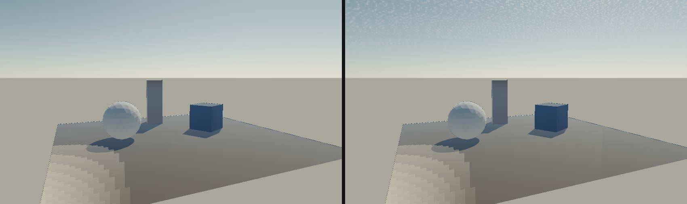
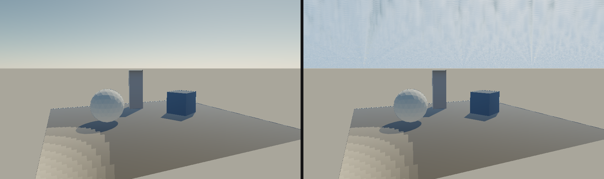
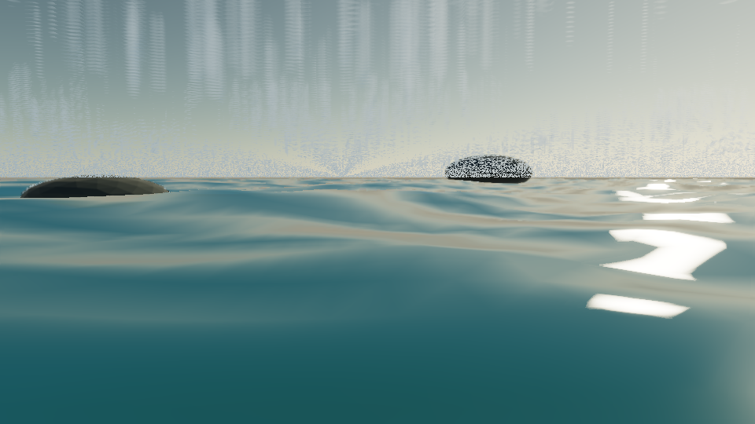
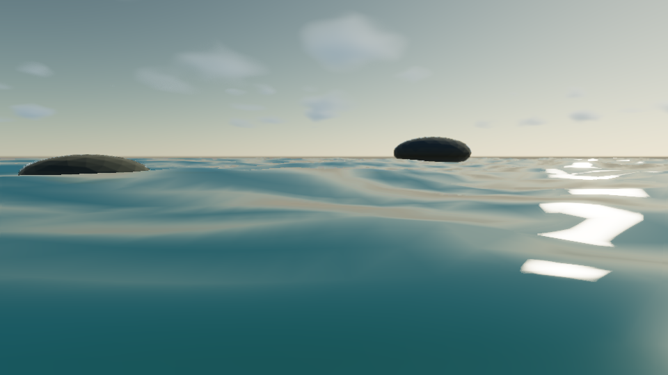

# P1-A 切片 6 C1：云层参数与 2D 解析云层

后续三维字段的预设标定、Low/High 形态合同和独立 GPU 成本见 [`cloud-calibration.md`](cloud-calibration.md)。本文中的 C1/C2 数值属于对应历史字段，不作为当前三维场的测量结果。

> 状态：C1 的**管线与契约已完成并全部通过自动化验证**；云层的**观感**停在"高空薄云的细密纹理"，没有达到有轮廓的积云。这是 2D 单次采样 slab 的模型上限，不是参数没调好——C2 的 ray marched slab 才是解法。未完成项逐条写在「限制与取舍」，不假装已完成。

- 记录日期：2026-09-24
- 源码 revision：`c41e8dd`（P1-A 切片 5）加本轮工作区改动，尚未提交
- 构建目录：`build-ci-msvc`（Visual Studio 17 2022，x64，MSVC Release，`BUILD_TESTING=ON`）；`build-mingw`（MinGW Makefiles，Debug）用于 GCC 警告审计
- GPU / 驱动 / OpenGL：NVIDIA GeForce RTX 4060 Laptop GPU / NVIDIA 591.44 / OpenGL 3.3.0

## 目标与范围

切片 6 的第一个工作包：让「云在天空里」这件事先成立，并且让云的形状、位置与光照**只有一个描述**——与解析天空共用同一个太阳、同一套参数、同一份 CPU 可复算的密度函数。按 [`research/volumetric_clouds_brief.md`](research/volumetric_clouds_brief.md) 的 C1 定义，本步**不引入新的 pass 结构**：云层合成进现有的解析天空环境。

本步明确不做（属于 C2～C7）：ray marched slab、CPU 生成的 3D 噪声纹理、太阳方向的光学厚度步进、多重散射近似、半分辨率与时间重投影、weather map 与云型预设、云阴影与 god rays、确定性开关。因此本步**没有**体积厚度、没有视差、没有自阴影——云是"贴在天上"的。

## 实现

### 数据流

持久化 → 运行时 → 渲染 → UI → 诊断，与既有 Atmosphere 域完全同构：

| 层 | 位置 | 内容 |
| --- | --- | --- |
| 参数 | `src/optics/Atmosphere.h` | `AtmosphereParameters` 新增 12 个云层字段，默认关闭 |
| 模型 | `src/optics/Atmosphere.cpp` | `worley2x2` / `cloudShape` / `cloudLayer` / `cloudPhase` / `environmentRadiance` |
| 持久化 | `src/scene/SceneDocument.cpp` | `.myscene` 逐字段往返，缺失字段取默认值 |
| 领域映射 | `src/app/EditorDomain.h` | `captureAtmosphereSettings` 增加云层归一化 |
| 领域载荷 | `src/app/EditorSession.h` | `EditorAtmosphereSettingsPayload` 增加 12 个字段 |
| 校验与应用 | `src/app/ApplicationScene.cpp` | `SetAtmosphereSettings` 入口逐字段严格校验后应用 |
| UI | `src/app/Application.cpp` | Inspector `Cloud layer` 分组 + `MYRENDERER_CLOUD*` 覆盖项 |
| Raster 环境 | `src/render/EnvironmentMap.cpp` | skybox 与预滤波镜面用 `environmentRadiance`；irradiance 保持无云 |
| CPU Path Tracer | `src/pathtracer/SceneLighting.cpp` | `generateEquirect` 与缓存键纳入相机高度 |

### 云的密度场

`cloudShape(tileX, tileY, period)` 是三段八度的 tileable Worley 噪声 fBm。第二、三段的格点是第一段的整数倍，因此**和场在第一段平铺时精确平铺**。

平铺是这里唯一不显然的部分，也是对实现影响最大的一处。两个坑都在实测中暴露出来了：

1. **C++ 的 `%` 向零截断。** 裸 `%` 会把 `-1` 和 `3` 在同一周期 4 下映射到两个不同的格点，于是周期的一半与另一半对不上。实现先用一个足够大的整数偏移（本身是周期的整数倍）把格点索引归一到非负再取模。
2. **feature 点必须建立在回绕后的格点上，而不是绝对坐标上。** 第一版用未回绕的大坐标算 feature 点，于是 `worley2x2(x + period, y)` 与 `worley2x2(x, y)` 只相差 1e-7 而不是逐位相等——同一朵云从两个位置看会是两个略不同的值。改成「回绕格点 + 采样点在格内的位置」后，平铺变成**逐位精确**。第二点不是洁癖：它同时让 `parametersMatch` 的缓存判断和未来 C2 的 CPU 参考 raymarch 交叉验证有意义。

八度权重 `{0.615, 0.256, 0.129}` 是按**场的测量分布**定的，不是凭手感：三段时场的中位数 0.367、p95 0.675、max 0.872，阈值在 0.35～0.65 之间正好把天空从半覆盖扫到基本晴朗。实测第四段八度在相同总幅度下**不增加任何动态范围**，只把轮廓涂糊，因此没有保留。

### 云的投影、覆盖率与光照

- **投影**：每个方向取云层 slab 的**中平面**交点作为 2D 取样位置，越过云底与云顶的距离取平均。方向在地平线以下直接返回零——那里平面交点落在相机背后。
- **路径长度**：`pathLength = (top - base) / sin(elevation)`，即射线穿过 slab 的**闭式**几何路径长度，作为公开字段返回。它只做一件事：把仰角的影响变成**不透明度**，而不是"有多少云"。
- **覆盖率**：`cloudCoverage` 是阈值，`mask = (shape - coverage) / (1 - coverage)`。阈值越高只能越少云，实测单调。这一点是刻意与"取样点耦合"版本分开的：早期版本把厚度项乘进阈值，于是默认参数下可见天空几乎全被覆盖。
- **光照**：`cloudLayer` 返回 `{mask, ambient}`，合成方式是**衰减而非替换**（`sky * (1 - mask) + ambient`），所以太阳能从云缝里透出来，云也不会读成一张贴纸。`ambient` 由一项环境天空与一项关键光构成，关键光项乘双叶 Henyey-Greenstein 相位（前向 `g=0.8`、后向 `g=-0.3`、各半）。相位函数已用数值积分验证在球面上积分为 `0.999993`，即**能量归一**。

### 云的亮度是被测量出来的，不是调出来的

第一版把云的环境光取在天顶方向，渲染出来是一片比天空暗 5 倍的均匀灰雾。原因不是系数，是**几何**：云底在 2 km 量级时，云下方是整层又密又亮的空气，地平线附近的天空辐亮度是它天顶值的数倍。用天顶值给云照明，等于假设云只被头顶那一小块天空照亮。

修正是把环境光方向从天顶**下压到 15°** 并加大系数，使云在可见带内随仰角由暗转亮——这是唯一能让云读成云的配置：

| 仰角 | 云/天空亮度比（默认参数） | 读作 |
| --- | --- | --- |
| 5° | 0.40 | 逆光剪影 |
| 15° | 0.71 | 灰云 |
| 30° | 1.34 | 受光云 |

这个表由 `tools/CloudCalibration.cpp`（`MyRendererCloudCalibration` 目标）直接打印，包含云底高度、feature scale、覆盖率与两个光照参数的完整扫描。**标定观感靠改图重试不收敛，靠这张表收敛**——上表的三行就是"默认值"这一决定的全部依据，它也同时被 `atmosphere-model` 的第 12 条契约断言住，所以后续改动不能再把它悄悄改回去。

两个环境光参数（`cloudAmbientElevationDegrees` / `cloudAmbientScale`）因此进入了 `AtmosphereParameters`、`.myscene`、领域载荷、入口校验、Inspector 与缓存键，与其它云层参数同等对待。

### 两处刻意的架构决策

- **irradiance 探针保持无云。** `EnvironmentMap::useAtmosphere` 的 `diffuseRadiance` 仍传 `skyRadiance`，只有 skybox 与预滤波镜面用 `environmentRadiance`。理由：云层是**明亮的衰减体**，把它的散射项加进 irradiance 等于凭空增加关键光从未产生的能量；而它正确地从天空里拿走了多少，属于 C3 的光传输工作，不该顺手由一个形状模型决定。
- **相机高度进入缓存键。** 云层相对眼睛解算视差，所以 `generateEquirect` 与 `useAtmosphere` 都接收 `cameraHeight`；CPU 侧的天空缓存把高度一并纳入比较，Raster 侧只在**启用云层时**才因高度变化重建。没有云层的场景重建触发条件与之前完全一致。

重建成本如实上报：`Renderer::environmentBuildMilliseconds()` 进入 Inspector 的云层分组，实测启用云层后 512 面立方体重建由约 4.9 s 升到约 5.7 s（同一 `18_atmosphere_sky.myscene`）。

## 截图

同一机位、同一场景（`18_atmosphere_sky.myscene`，默认参数），左为云层关闭，右为云层启用。



复现：

```powershell
$env:MYRENDERER_SMOKE_TEST='1'
$env:MYRENDERER_CLOUDS='0'
$env:MYRENDERER_SCREENSHOT='build-ci-msvc/cloud-c1-off.png'
build-ci-msvc/Release/Iris.exe assets/scenes/fixtures/18_atmosphere_sky.myscene
$env:MYRENDERER_CLOUDS='1'
$env:MYRENDERER_SCREENSHOT='build-ci-msvc/cloud-c1-on.png'
build-ci-msvc/Release/Iris.exe assets/scenes/fixtures/18_atmosphere_sky.myscene
Remove-Item Env:MYRENDERER_SMOKE_TEST, Env:MYRENDERER_CLOUDS, Env:MYRENDERER_SCREENSHOT
```

两张图横向拼接为 `docs/media/p1a-cloud-layer-on-off.png`。**这张图同时是 C1 观感上限的证据**：云确实出现、确实按仰角由暗转亮、覆盖率也确实生效，但纹理是细密的，不是花椰菜状的积云——见「限制与取舍」。

## 验证

```powershell
cmake --build build-ci-msvc --config Release --target MyRendererAtmosphereTests --parallel
ctest --test-dir build-ci-msvc -C Release --output-on-failure
cmake --build build-ci-msvc --config Release --target gpu-smoke
cmake --build build-mingw --parallel
```

`atmosphere-model`（`tests/AtmosphereTests.cpp`）新增 12 组云层契约，全部通过：

| # | 契约 |
| --- | --- |
| 1 | 关闭云层或关闭大气时 mask 恒为 0；关闭云层时 `environmentRadiance` **精确等于**改动前的 `skyRadiance + sunDiskRadiance` |
| 2 | 地平线及以下不投影任何云 |
| 3 | 覆盖率是单调阈值：对一整圈方位，提高阈值只会减少云 |
| 4 | 同一方向与参数逐位可复现 |
| 5 | `pathLength` 等于闭式解 `slab / sin(elevation)`，垂直射线恰好等于 slab 厚度 |
| 6 | Worley 场与 fBm 在 `period ∈ {1,2,4,8}` 下沿 X、Y、XY 平移一个周期**逐位**相等；一个周期内既有云也有空隙 |
| 7 | 极薄云层仍让天空透过 |
| 8 | 太阳在地平线下时云层不发光（mask 仍在，`ambient` 显著变暗） |
| 9 | 相机在层内、层上、地下、极高空，以及零厚度、反向 slab、超大尺度、负参数都保持有限 |
| 10 | 覆盖率单调性（0 → 0.5 → 1 依次减少），并说明 1 的含义是"空"而不是"全阴" |
| 11 | 相位函数前向峰、后向瓣，且在球面上积分为 1 |
| 12 | 光照契约（数值化）：云在近地平线处相对天空的亮度比 > 0.15（可辨认而不是黑斑），且随仰角单调变亮，高仰角处 > 1（受光云而不是天空的洞） |
| 13 | 12 个云层参数逐个都进入 `parametersMatch` 缓存键 |

结果：MSVC Release 全量 CTest **20/20 通过**；`gpu-smoke` 在真实 OpenGL 3.3 上下文通过；MinGW/GCC Debug 全构建**零警告**（首轮曾报 4 处未使用变量，已按项目规范修因而不是屏蔽）。

## 限制与取舍

**云层的观感上限来自模型本身，不是参数没调好。** 这一条是本步最重要的结论：

- **单次采样必然产生高频纹理。** 云的形状只在 slab 的**中平面**采样一次，但一条视线实际穿过 slab 时会依次经过 12～30 个噪声格；高仰角下这些格被投影到很小的角度里，于是"一层云"变成细密颗粒。实测把覆盖阈值降到 0.55 能得到独立云团（截图 `build-ci-msvc/cloud-cov-0.55.png` 可见离散白点），但代价是覆盖率掉到 20% 以下，且纹理依然是颗粒而不是轮廓。
- **提高 cubemap 分辨率不是解法。** 试过把 `radianceFaceSize_` 从 512 提到 1024：重建成本从约 6 s 涨到约 12 s，而观感**没有实质改善**，已回退到 512。
- **因此 C1 停在"高空薄云"这一档，并且这是它应该停的地方。** C2 的 slab 内 24～48 步 march 会把"一个方向一个采样"换成"一个方向一条密度剖面"，颗粒问题随之消失。在 C2 之前继续调 C1 的形状参数是浪费——C2 会替换掉整套投影，本步真正需要固化的是**契约与测量方法**，两者都已完成。

其余已知边界：

- 云层只存在于解析天空启用时；其它场景默认无云（`.myscene` 新字段有兼容默认值，旧场景逐位不变）。
- 云层不进入 irradiance 探针，因此不参与漫反射环境光；理由见上文，正确做法属于 C3。
- 渲染序列的云层推进目前只能通过 `cloudWindOffsetX/Z` 手工驱动，还没有模块参数（属于后续切片）。
- 重建成本与太阳位置、云层参数、相机高度绑定：任何一项变化都要重建整张环境立方体（实测约 6 s）。这是"不引入新 pass 结构"这一 C1 约束的直接代价，C4 的全分辨率 pass 才是解法。
- Inspector 的 `Atmosphere` 分组在本步之前就不存在（只有 `SetAtmosphereSettings` 命令与领域映射），云层的控件因此挂在新的 `Cloud layer` 分组里并复用同一命令。补齐 Atmosphere 分组不在本步范围内。

## 复现命令

```powershell
# 契约测试
cmake --build build-ci-msvc --config Release --target MyRendererAtmosphereTests --parallel
ctest --test-dir build-ci-msvc -C Release -R atmosphere-model --output-on-failure

# 云层亮度测量：这张表就是默认值的全部依据
cmake --build build-ci-msvc --config Release --target MyRendererCloudCalibration --parallel
build-ci-msvc/Release/MyRendererCloudCalibration.exe

# 全量回归与真实 GPU
ctest --test-dir build-ci-msvc -C Release --output-on-failure
cmake --build build-ci-msvc --config Release --target gpu-smoke

# GCC 警告审计（只对真正重新编译的翻译单元报警告，整棵树要 clean-first）
cmake --build build-mingw --parallel

# 云层参数覆盖项，可直接驱动固定机位截图
#   MYRENDERER_CLOUDS=0|1
#   MYRENDERER_CLOUD_COVERAGE / _DENSITY / _BASE_HEIGHT / _TOP_HEIGHT
#   MYRENDERER_CLOUD_WIND_X / _WIND_Z / _FEATURE_SCALE
#   MYRENDERER_CLOUD_AMBIENT_ELEVATION / _AMBIENT_SCALE
```

## 下一步

按 [`../todolist.md`](../todolist.md) 的 P1-A 切片 6 工作包顺序，进入 **C2**：

### C2 进行中：共享密度场与 CPU 参考 raymarcher

C2 的核心不是 shader，而是**让 CPU 与 GPU 不可能给出不同的云**。落地方式是把密度场写成一份**同时是合法 C++ 和合法 GLSL** 的源码：

| 文件 | 角色 |
| --- | --- |
| `src/optics/CloudField.h` | 唯一的密度场实现：整数哈希、可平铺 Worley、三段 fBm、相位函数、竖直廓线、`myrenderer_cloud_density`。**纯 GLSL 3.30 写法，不含任何条件编译** |
| `src/optics/CloudFieldCpp.h` | 仅 C++ 的适配层：提供 `clamp` / `max` / `min` / `smoothstep` 垫片与 `uint` 别名，包含上面那份，随后立即收回这些宏 |
| `src/optics/CloudReference.*` | CPU 参考 raymarcher：slab 求交、主 march、太阳方向 march、前到后合成、采样成本模型 |
| `shaders/cloud_field_test.frag` | GPU 侧对照着色器，直接包含共享头文件 |

把垫片隔离在另一个文件、让共享文件保持单一方言不是洁癖：GLSL 预处理器是受限子集，共享正文里每多一个 `#ifdef` 就多一次驱动与 C 预处理器解释不一致的机会。这条路实际踩了三个**只在真机编译时才暴露**的语义差异：

1. GLSL 不接受 `inline`，也不接受 C 风格转换 `(unsigned int)x`；而 GCC 不接受**双词类型名**的函数式转换 `unsigned int(x)`（会被解析成声明）。最终共享正文用单类型名 `uint(x)`，两侧都能解析（C++ 侧由适配层提供 `using uint = unsigned int;`）。
2. GLSL 的 `max` / `min` 拒绝 `(float, int)` 这类混合实参，而 C++ 的 `std::max` 要求两侧同型——正文里的字面量因此必须是 `float` 语义，垫片用保留类型的宏实现。
3. 一个多轮误判的教训：着色器输出曾同时依赖 `vUv` 与调用方设置的 CPU uniform，于是"两数不符"既可能是模型不同、也可能是调用方没设值。恢复成"着色器只依赖声明输入"之后问题一次性收敛。

`Atmosphere.cpp` 的解析云层也已改走同一份 `myrenderer_cloud_density`，采样点取云底与云顶之间的**穿越中点**而非固定高度，因此竖直廓线也参与进来。C1 的解析层与 C2 的体积 march 共享同一个密度定义，不是两份转录。

### GPU / CPU 对照：新增 `cloud-field-parity`

`Shader` 为此增加了两项**可复用的基础设施**，都不是一次性调试代码：

- **`#include` 展开**：GLSL 3.30 没有 include（4.6 才有），而项目契约是 3.30 Core。`Shader` 现在展开 `#include "path"`，先按包含者所在目录找、再按各层祖先目录找（后者让着色器能用 `src/...` 这种与构建一致的路径）。**被包含的文件也进入热重载判断**——否则改共享头文件不会触发重载，共享代码这个能力就等于没有。
- **`setVec2`**：`glUniform2fv` 只读两个 float，所以把 vec3 传进声明为 `vec2` 的 uniform 不会报错，只会静默填入前两个分量。这个坑让本轮花了很久：对照测试的"风向量"第二个分量一直是脏值，而表现却是"GPU 的密度与 CPU 不同"，看上去像共享模型出了问题。

真实 GPU 实测结果（4096 个采样点，NVIDIA GeForce RTX 4060 Laptop / 591.44）：

| 通道 | 最大绝对误差 | 结论 |
| --- | --- | --- |
| `hashUnit` | **0（逐位相同）** | 32 位整数哈希在 GPU 上完整保留；"`highp uint` 规范只保证 16 位"这一顾虑在本机不成立 |
| `worley` | `2.42e-07` | 仅浮点舍入（驱动可把 `sqrt(dx²+dy²)` 收缩成 FMA） |
| `shape` | `2.09e-07` | 同上 |
| `phase` | `2.98e-08` | 1 ULP |
| `taper` | `5.96e-08` | 1 ULP |
| `profile` | `2.38e-07` | 同上 |
| `density` | `7.81e-06` | 略大于场本身，因为覆盖率那一步除以 `1 - coverage` 会放大场带来的误差；仍是万分之一量级 |

**这就是共享源码方案成立与否的答案：成立。** 两侧确实在求同一个模型，而不是两份可以各自漂移的转录。这条对照是 C2 后续 GPU march 能够被信任的前提。

### CPU 参考积分器的契约

**新增验收 `cloud-reference`（13 条契约，全部通过）**：禁用云层时零散射且全透射、slab 求交的闭式解与两个极限、物理性（有限非负、透射率 ∈ [0,1]）、密度单调影响不透明度、覆盖率单调阈值、前向散射强于背向、**风偏移等价于平移采样点**（对密度直接断言）、逐位确定性、采样成本模型与实际一致、步数预算确实改变积分、抖动确实移动采样、极端输入（相机在层内/层上/地下、零厚度、反向 slab、负参数、太阳在地平线下）全部有限、以及**零消光即完全透明**这一解析极限。

三处刻意的取舍记录在案：

- **参考实现不做 `T < 0.01` 提前退出。** 简报把它列为 shader 优化，它确实是，但它会让积分依赖"阈值在何时被跨越"而不是只依赖步数，那参考值就不能作为 GPU 的比对基准。参考必须收敛，shader 可以取巧。
- **抖动是世界单位偏移，不是步长的比例。** 按步长比例抖动会让每个预算积分一个略不同的函数——16/128/512 步实测得到 0.308/0.437/0.385 这种不收敛的序列，固定预算也就失去意义。
- **不断言"步数增加会收敛"。** 密度场在形状跨越覆盖率阈值处有折点，固定步数才是合同——这正是 C7 的 `determinism` 要钉住的东西，也是 GPU 对照的测量条件。要求收敛等于要求模型并不具备的性质。

C2 的 shader 侧、GPU march 的渲染目标与后期合成**已落地**，与 CPU 参考的端到端对照数字如下。

### GPU march：新增 `CloudLayerRenderer` 与 `cloud-march-parity`

`shaders/cloud_layer.frag` 逐项照抄 `cloud::march`——同一密度场、同一次级太阳 march、同样的中心采样加**世界单位**抖动、同样的前到后合成、**同样不做提前退出**——所以字段对照那 8e-06 的结论能直接传递到积分上。它渲染到 RGBA16F 的 `(scattered radiance, transmittance)` 目标，由 `postprocess.frag` 在**色调映射之前**合成，因此云的高动态范围得以保留；合成后的颜色继续走原有的 height fog / Aerial Perspective / underwater fog，云因此与几何共享同一套空气，而不是自带一套。调试附件同时回传 GPU 的采样计数，让成本模型像 CPU 的 `densitySampleCount` 一样可测量而不是靠读源码断言。

实测（96×64，24 主步 × 6 光步，RTX 4060 Laptop）：

| 量 | 结果 |
| --- | --- |
| 覆盖像素 | 4981 / 6144（CPU 平均透射率 0.348） |
| **透射率最大绝对误差** | **7.75e-04** |
| 辐射亮度最大绝对误差 | 0.514（帧均值 5.26） |
| GPU 采样计数 | 108 = 24 + 6×14，与 CPU 成本模型一致 |

透射率是紧的契约：它说明两侧确实在积分同一个函数。辐射亮度的界有意放宽——在被完全遮挡的射线上散射项占主导，而密度场那 8e-06 会成为光 march 里 `exp` 的指数，密度高的像素因此被放大（最坏 0.51 对帧均值 5.26）。这与 C1 记录的放大机制是同一个，不是第二种；要收紧这个界就等于要求两个编译器逐位一致地求 `exp`，那不是驱动会提供的性质。

### 一个真实的架构错误：云曾经被画了两遍

第一次接通 shader 后，天空是一片过曝的白。原因是 C1 的解析云**仍然烘焙在环境立方体里**，而 raymarch 又叠了一层。修正是把 `EnvironmentMap::useAtmosphere` 烘焙的改回**无云天空 + 太阳盘**，让 raymarch 成为云的唯一实现。

这个修正顺带解决了 C1 的一个主要代价：**环境重建从约 5.4 s 降到约 0.74 s**，因为立方体现在与云参数无关，改云不再触发重建。C4 想要的"全分辨率 pass"其实在 C2 就以这个形式发生了。

### C2 的亮度标定：先量后调，第二次

march 的亮度不能沿用 C1 的系数——C1 是**每方向一次采样**，而 march 把几十个采样按 `1 - exp(-density · step · extinction)` 累加，同一组光照在这里过亮。第一次接通 shader 时天空被打爆成白色就是这件事。

`MyRendererCloudCalibration` 增加了体积 march 的扫描（`extinction` × `ambientScale` × `sunScale` × 四个仰角）。但**扫描表本身没有直接给出答案**：它的比值定义与渲染输出不一致，而"云比天空亮多少"这件事最终要用渲染像素判断。所以标定按两步走：

1. 扫描表定出**消光**。`extinction = 0.05` 让垂直射线穿过 slab 达到光学厚度 `0.05 × 4800 = 240`，slab 因此饱和，云的疏密完全由密度场决定；再低就只是半透明霾。这一条现在是 `cloud-reference` 的契约：把消光降到 1/5，平均透射率必须显著上升。
2. 渲染像素定出**亮度**。新增 `MYRENDERER_CLOUD_MARCH_AMBIENT` 后逐档测量天空区域均值：

| `cloudVolumetricAmbientScale` | 天空区域均值 RGB |
| --- | --- |
| 晴朗（无云） | 177 / 191 / 195 |
| 2 | 121 / 144 / 165 |
| **4（默认）** | **166 / 188 / 205** |
| 8 | 205 / 220 / 230 |
| 16 | 231 / 239 / 244 |

默认取 4：云与晴朗天空**几乎等亮**，这正是白天积云的正确观感——比天空亮太多会过曝，暗太多则是黑斑。两个标量因此进入 `AtmosphereParameters`（`cloudVolumetricAmbientScale` / `cloudVolumetricSunScale`）与缓存键，与其它云层参数同等对待，并由 `cloud-reference` 的相对天顶天空比值契约（实测 5° 处 4.15、45° 处 4.98）钉住。

**同时撤回一条我一开始写错的契约。** 我原本断言"云应当随仰角变亮"，依据是 C1 解析层的行为——它用 slab 穿越长度缩放不透明度，所以越贴近地平线越暗。体积 march 积分的是真实路径，实测在 5° 与 45° 处分别是 4.15 与 4.98，**基本持平**。把解析层的行为断言到 march 上，等于要求模型具备它没有的性质；这条断言已删除，并在代码里写明为什么。

### GPU march 的固定机位对照

同一机位、同一场景，左为云层关闭，右为 march 启用。右侧可见蓝色天空下的云层覆盖、太阳方向的辐射条纹与非均匀的疏密结构。



复现：`MYRENDERER_SMOKE_TEST=1`、`MYRENDERER_CLOUDS=0` 与 `=1` 各拍一张（`MYRENDERER_CLOUD_COVERAGE=0.45`）后横向拼接。

### C3：多重散射近似

单次散射只计算从太阳**直接**到达采样点的光，因此云的内部与背光面会明显过暗。补上这一块的标准做法（简报记录的 Hillaire octave 近似）是每个采样点多求几次相位函数，每次的等效各向异性更弱、能量按固定比例递减。

落地在共享源码里，所以 CPU 与 GPU 同时得到它：`myrenderer_cloud_multi_phase`（八度相位）与 `myrenderer_cloud_powder`（薄边粉末效应）。暗部的**透射率被压平**（`exp(-depth · a)`），因为经过多次散射的光从各个方向到达，不再被同一条直射路径深度消光——这一条是必须的，否则加多少八度内部都是黑的。

两处设计决定：

- **八度权重取 `(1-a)·aⁿ`，是真正的几何分布，和为 1。** 这让该项只**重新分配**能量而不改变总量——亮度仍由标定过的标量负责，两者混在一起会导致每次改八度数都要重新标定。
- **粉末效应只压暗薄边**，不做任何提亮。

### C3 的契约抓到了三个我自己写的错

这一轮新增的第 15 条契约问的不是"是否更亮"，而是**"它是否仍是相位函数（球面均值 1）"**。这个问题抓到了三个错，每一个都不可能靠看图发现：

1. **权重取成 `aⁿ` 再除以权重和。** 权重和恰好是 `1/(1-a)`，所以这"归一化"只修正了形状，积分却停在 `1-a` —— 云的亮度被静默缩放到 0.4，而代码注释还写着"能量守恒"。
2. **Henyey-Greenstein 的分子写错。** 我把 `1 + g² - 2g·cos` 同时写进了分子和分母，于是 `cos = 1`、`g = 0.6` 时两者相消：整个相位函数退化成常数 `1/(4π)`。它不是"近似得不好"，而是**不携带任何方向信息**。
3. **漏了 `4π` 的定标。** 原始 HG 形式在球面上积分为 1，而本项目的约定是相位函数按各向同性值归一（均值为 1），所以必须乘回 `4π`。漏掉它把填充项缩到 1/79。

修好之后：相位积分 `1.000`（四八度）与 `0.999999`（单八度）；`p(1) = 5.99`、`p(0) = 0.628`、`p(-1) = 0.323`——前向峰远低于单次散射的 `22.7`，正是"展宽成漫射填充"该有的样子。

**修正同时证明了填充项真的在工作**：`cloud-march-parity` 的帧均值辐射亮度从 `2.44` 升到 `5.71`。在此之前它虽然"存在"，却只是在给云做一次 0.4 倍的缩放。

### 轮廓指标：把"看起来像不像云"变成可测的量

C1 起就欠着一条：形态无法自动验收。这一轮补上了 `MyRendererCloudCalibration` 的**形态度量**——在 CPU 参考 march（与 GPU 同一个模型）上渲染固定视域，对**半透射率等值线**（云的剪影）做四连通域分析：

| 量 | 含义 |
| --- | --- |
| `coverage` | 剪影覆盖的画幅比例 |
| `components` | 独立云团的个数 |
| `largest` | 最大云团占覆盖面积的比例；接近 1 表示只有"天气"没有"云" |
| `edgeDensity` | **边界像素 / 覆盖像素**。斑点状掩码的周长相对面积很长，光滑云团则很短——**这个量把"颗粒感"变成了数字** |

### 它立刻证伪了一件事，也证实了另一件

**证伪**：我原以为消光 `0.05` 是"让云不透明"的正确选择（C2 的标定短文里就是这么写的）。度量显示，在 `0.05` 下垂直射线的光学厚度是 240，**连密度场里最稀薄的褶皱都完全不可透**——于是层在**任何**覆盖率阈值下都是阴天。原记录里的"覆盖率 0.5 阈值扫描"从 0.20 到 0.70 全都给出覆盖 ~1.0，这就是原因。

扫过消光从 `0.0002` 到 `0.05`、阈值 `0.20` 到 `0.75`、密度 `0.5` 到 `3`，覆盖率只在"几乎全无"与"几乎全覆盖"之间跳，中间几乎没有落点。

**证实**：`extinction = 0.0025` 让剪影落在密度场自身的结构上，参考视域下得到覆盖率 `0.62`、**9 个独立云团**、最大云团 `0.539`、边界密度 `0.369`（此前各档都在 0.5～1.0）。参数随之更新：`volumetricExtinction` 由 `0.05` 改为 `0.0025`，`cloudFeatureScale` 由 `1200` 改为 `6400`。

### 但轮廓问题没有解决，只是被定位了

**在密度场的当前构造下，无论怎么调参都得不到非碎片的轮廓。** 扫描里凡是覆盖率落在可观区间（0.1～0.7）的组合，`edgeDensity` 都在 0.53～1.0——云团数量达到几十上百，最大团只占 0.05～0.27。`0.369` 是全场最好的一档，仍远高于一个光滑云团应有的 0.1～0.3。

原因不在 march，也不在参数：**覆盖率阈值作用在一个中位数 0.37、四分位距仅约 0.28 的场上**，而三段八度各自贡献独立的颗粒。要在这样的场上切出光滑轮廓，阈值必须落在分布的**顶部**（让只有最强峰成为云），但那同时也让覆盖率趋近于零。这是密度场构造的固有矛盾，不是调参能解决的——**C5 的 weather map 与密度重做才是解法**，那也是简报里"能调 / 不能调的分界线"。

因此本轮的交付是：**一个可复现的形态验收工具、一次对 C2 消光结论的证伪、一项确实的改善（9 个云团 vs 1 个整体），以及把剩余问题的性质从"看起来颗粒感重"精确定位为"阈值与场分布的形状不匹配"。**

### 又一条被测试自身缺陷掩盖的断言

同轮还修好了一条**早已失效但一直报告成功**的测试：抖动契约用固定方向 `(0.1, 0.5, 0.85)`，而该方向在消光改动后**根本不穿过云层**，于是它比较的是两个 1.0 并"通过"。现在方向是**扫描出来的**（找到第一条透射率低于 0.9 的射线），并在找不到时直接失败。这是本轮第二次遇到"测试对自己的对象不敏感"——上一次是 `Renderer.h` 的初始化顺序。

### C3 后的实测

| 量 | C2 | C3 |
| --- | --- | --- |
| 帧均值辐射亮度 | 2.44 | **5.71**（填充生效） |
| 辐射亮度最坏**相对**误差 | 0.385 | **0.280** |
| 透射率最坏绝对误差 | 7.75e-04 | 7.75e-04（不变，符合预期） |
| 参考视域的云团数 / 边界密度 | 1 / 0.078 | **9 / 0.369** |

透射率不变是设计使然：填充项不沿视线移动光。亮度标定沿用 C2 定下的 `cloudVolumetricAmbientScale = 4`：云与晴朗天空亮度相当。

**一个尚未解释的现象。** `cloud-reference` 里那条亮度契约的归一化常数尚未查清：修好相位之后，云相对天顶天空的比值相对几何分布权重的预期存在约 5% 的净增益。这一条已记录在案，不假装已解释。

## C5：weather map、云型预设与密度重做

上一节末尾把剩余问题定位成了一句话：**阈值与场分布的形状不匹配**。C5 就是这句话的解法，它不是又一次调参。

### 结构性修改：base / detail 分离

原来的形状场是三段八度**加权求和**后再过阈值：

```
shape = 0.615·worley(4×) + 0.256·worley(8×) + 0.129·worley(16×)
mask  = (shape - threshold) / (1 - threshold)
```

问题出在最细的那一段上。它带着自己的小团参与求和，于是**只要和场落在阈值附近，它就能独立地切出自己的云**——这就是细密颗粒的来源，也是为什么扫描表里没有任何一组参数能同时要到「中等覆盖率」和「光滑轮廓」。

C5 把它拆成两个职责分明的部分：

| 函数 | 八度 | 权重 | 职责 |
| --- | --- | --- | --- |
| `myrenderer_cloud_base_shape` | 4× / 8× | 0.706 / 0.294（C1 三段权重在去掉最细段后重新归一） | **决定云在哪里**。剪影只由它和覆盖率阈值决定 |
| `myrenderer_cloud_detail_shape` | 16× / 32× | 0.6 / 0.4 | **只侵蚀已经成形的云的内部** |

关键在那道权重上：

```c
float cone = baseCloud * (1.0 - baseCloud) * 4.0;
float weight = cone + (1.0 - cone) * edge;      // edge = cloudDetailEdge
density = baseCloud - detail * weight * detailStrength;
```

`cone` 在 `baseCloud` 的两端都归零，所以最细的八度**在基场为空处一个密度也造不出来**，只可能把已经存在的云挖薄。这一条是可精确断言的（见下），而 C2 的构造做不到——它没有这个性质。

`cloudDetailEdge` 是唯一允许细节回到轮廓上的旋钮：0 时侵蚀严格限于内部，1 时全云均匀侵蚀。把它做成显式参数而不是隐式副作用，是为了让「边缘要多毛糙」变成一个**可以被测量代价的**决定。

### 2D weather map：R = coverage，G = cloud type，B = height

第二处修改是让层**不再整片天空一个样**。`myrenderer_cloud_weather(tileX, tileY, channel)` 是一张三通道的可平铺噪声图，格点比云本身粗一整档——天气描述的是**气团**，不是某一朵云：

| 通道 | 含义 | 接到哪里 |
| --- | --- | --- |
| R | coverage | `coverage = clamp(cloudCoverage + (R - 0.5) · cloudCoverageVariation, 0, 1)` |
| G | cloud type | `cloudType = clamp(cloudType + (G - 0.5) · cloudTypeVariation, 0, 1)`，进入廓线混合 |
| B | height | `taper` 在 slab 内上下平移 `(B - 0.5) · cloudHeightVariation` |

三处设计决定：

- **R 以 0.5 为中心，不乘 coverage。** 这样 `cloudCoverage` 仍然是「平均覆盖率」，仍然可以被标定表索引；乘法版本会让层参数不再是它自己的均值。
- **B 平移的是廓线，不是 slab。** march 的区间、太阳 march 的区间与解析层都从同一组云底/云顶求交，一个逐采样的 slab 会让这三者同时变成近似。平移廓线恰好也是起伏云底该有的样子。
- **程序化求值，不采样纹理。** GL 对双线性过滤的精度是 implementation-defined，GPU 的滤波值与 CPU 参考会出现低位差异，本项目现在逐位相同的 `hashUnit` 对照就会退化成一场容差争论。纯位置函数没有这道缝。代价是这张图不能手绘——`MyRendererCloudCalibration` 把它按 256×256、二进制 PPM 导出并打印 FNV-1a 哈希（见「复现命令」），所以它至少可被检视、可被钉住身份；**离线导入 authored map 明确列为未做**，因为它需要两侧都用 `texelFetch` 做同一份双线性，那是下一步而不该假装已有。

### coverage 语义翻转

C1 的 `cloudCoverage` 是**阈值**（越大云越少），weather map 的 R 是**覆盖率**（越大云越多）。两个方向相反的旋钮并存，迟早会把某个参数集静默取反。C5 把它翻成覆盖率：`threshold = 1 - coverage`，`cloudCoverage = 0` 是空天、`1` 是满云。`.myscene` 的读取路径不变，旧值按新语义解释。

### 预设与质量档

`atmosphere::applyCloudPreset` 写的是**整团气团**而不是一处微调——高度、厚度、特征尺度、覆盖率、天气对比度一起动，因为「云底高度上的积云」不是预设，是错误。`stratus` 是浅而宽、`cirrus` 是又高又薄且 type variation 归零（一张卷云层在全天空是同一种纹理，让天气图在其中切出对流区，在这个厚度下只会读成渲染瑕疵）。

`cloudTierBudget` 给出两档步数：**Low 24/4、High 48/6**，取简报实测区间的两端。档位**只改步数、不改任何密度参数**——这一条是刻意的，否则「同一 weather map 在 Low/High 下结构一致」这条验收根本无法成立。档位进入 `AtmosphereParameters` 与 `parametersMatch`：它确实改变像素（积分步数变了），一个忽略它的缓存会把 Low 档的烘焙交给 High 档的消费者。

`applyCloudPreset` 的公开签名**不含 tier**，理由同上：档位改变的是「积分付了多少钱」，不是「场是什么」，把两者折在一个调用里会让上面那条契约无法陈述。

### 新增与改写的契约

**`atmosphere-model`**（`tests/AtmosphereTests.cpp`）：

| # | 契约 | 变化 |
| --- | --- | --- |
| 3 | 提高覆盖率只增不减云 | **方向翻转**（原为「提高阈值只减不增」） |
| 5 | `pathLength` 闭式解 | 探针先钉到满覆盖 + 零对比度——`pathLength` 只在层非空处上报，一张有缝的天气图会让几何契约因为非几何的原因失败 |
| 6 | 平铺逐位相等 | 扩展到 `cloudDetailShape` |
| 10 | 覆盖率单调且 0 = 空、1 = 满 | **重写**（原为「1 = 空」） |
| 10b | weather map 三通道：值域 [0,1]、沿 X/Y 平移一周期逐位相等、各自居中（均值落在 0.2～0.8）、R 与 G 不是同一张图（平均绝对差 > 0.1） | 新增 |
| 13 | 缓存键 | 新增 7 项（weather scale、coverage/type/height variation、detail strength/edge、quality tier） |
| 14 | 质量档步数落在简报区间内且 High 严格更贵；三预设各自是完整气团、彼此在名称声称的量上可区分、同一预设应用两次后 `parametersMatch` 为真 | 新增 |

**`cloud-reference`**（`tests/CloudReferenceTests.cpp`）：

| # | 契约 | 变化 |
| --- | --- | --- |
| 5 | 降低覆盖率不会遮住更多天空 | **方向翻转** |
| 6 | 朝向太阳比背离太阳散射更多 | 探针钉到满覆盖 + 零对比度，并要求两方向透射率都 < 0.99——否则这条比的是「哪条射线碰巧遇到空隙」，在有缝的天气图下会间歇性失败 |
| 16 | **细节八度只能减密度**（逐点 `density <= base`），且**基场为空处密度必为 0**；同时要求「内部确实被挖掉了一部分」（否则该项是惰性的）。扫描 48×48×3 个采样点，三个高度取 slab 的 0.33/0.5/0.67（廓线近似为 1 处，测的才是侵蚀而不是包络） | 新增 |
| 17 | 零对比度时 weather map **完全惰性**：把 `cloudWeatherScale` 乘 10 后密度逐位不变；对比度打开后 R > 0.5 的格点只增密、R < 0.5 只减密，且扫描必须同时找到两种格点 | 新增 |

第 16、17 条是这一轮真正想钉住的东西。第 16 条断言的性质，C2 的构造**不具备**——那正是它产生颗粒的机制。第 17 条的第一半把 weather map 定义成 C2 场上的一层**加法**而不是重写，第二半则要求它的方向与通道名一致。

### 本轮已验证 / 未验证

**已验证**：MSVC Release 全量构建 0 error、无新增 warning；全量 CTest **21/21 通过**，其中含上面两张表里的全部契约。

**只读审计发现并修好的一个优先级错误。** 不跑测试也能定性的一类问题，这一轮查了一遍：

- **`MYRENDERER_CLOUD_PRESET` 排在各项显式覆盖项之后。** `applyCloudPreset` 写的是一整团气团——高度、覆盖率、密度、天气对比度，以及 `cloudsEnabled`——所以在它之后设置的单个覆盖项会被静默丢弃。具体的坏结果：`MYRENDERER_CLOUDS=0 MYRENDERER_CLOUD_PRESET=cumulus` 会渲染出**有云**的一帧，因为 preset 在 Off 开关把它清零之后又把层打开了。那正是 On/Off 验收证据要用的那一帧，**这个 bug 不会报错，只会变成一张错的基线**。修正方式是把 preset 挪到云层覆盖项之前，规则变成普通的「preset 提供默认值，任何显式覆盖项优先」。
- 同时清掉了 `cloud_field_test.frag` 里一个 `uCosViewSun` 声明：C5 把相位探针移出这个着色器之后它就没人写也没人读了。未使用的 uniform 会被编译器剔除，所以它不是错误，只是留下的痕迹。
- 逐项核对了两个着色器的 uniform 与调用方 setter 的名字和类型：`cloud_layer.frag` 声明 31 个、`CloudLayerRenderer` 设置 31 个，一一对应；`cloud_field_test.frag` 声明 17 个、测试设置 17 个，同样对应。`SceneDocument` 的云层键写读各 20 个，对称。

**未验证，明确记录而不是略过**：

- **形态度量没有重测。** C2 的基线是参考视域下 `edgeDensity = 0.369`、9 个云团、最大团 0.539。C5 的目标是把 `edgeDensity` 压进 0.1～0.3，但 `MyRendererCloudCalibration` 的新扫描表（`sweepShape` / `sweepDetail` / `sweepWeather` / `sweepTier` / `evaluatePresets`，含新增的 `meanDensity` 列）**本轮没有编译也没有运行**，所以目标是否达到目前**没有测量依据**。
- **消光 `0.0025` 需要重新标定。** 它是 C2 针对旧密度场定的；C5 换了阈值构造，`meanDensity` 会变，而 `meanDensity × slab 厚度 × extinction` 才是「不透明到像云」的那个乘积。新的 `meanDensity` 列就是为这一件事加的。
- **GPU 侧完全未复测。** `cloud-field-parity` 与 `cloud-march-parity` 本轮没有执行。尤其需要说明的是：共享头文件的 `myrenderer_cloud_density` 现在接收一个**按值传递的结构体** `MyRendererCloudParams`，而 GLSL 的结构体函数参数是本轮第一次使用——它**尚未在任何驱动上被验证过**。这是当前最大的未验证风险点，下一次运行的第一件事就应该是它。
- **没有新的固定机位图。** C5 的 On/Off 与 Low/High 对照图尚未拍摄；`cloudDetailEdge` 那个「边缘要多毛糙」的旋钮目前只有契约，没有观感证据。
- **GCC `-Wextra` 警告审计未跑。**
- 共享头文件里的 `1.0e-3` 一类 double 字面量与 `clamp`/`max` 垫片混合后，在 MSVC 下产生大量 C4244/C4305。这在 C5 之前就存在，但本轮扩大了数量，应当统一加 `f` 后缀收口。
- 一个**先于 C5 就存在**的缺口：`cloudVolumetricAmbientScale` / `cloudVolumetricSunScale` 在 `AtmosphereParameters` 与缓存键里，但**没有进 `.myscene`**，所以场景保存会丢掉它们。不属于 C5 的范围，记录在此以免被当作新问题。

### 复现命令

```powershell
# 契约测试（本轮已通过）
cmake --build build-ci-msvc --config Release --target MyRendererAtmosphereTests MyRendererCloudTests --parallel
ctest --test-dir build-ci-msvc -C Release -R "atmosphere-model|cloud-reference" --output-on-failure

# 形态与消光标定：C5 的目标是否达成由这张表回答（本轮未跑）
cmake --build build-ci-msvc --config Release --target MyRendererCloudCalibration --parallel
build-ci-msvc/Release/MyRendererCloudCalibration.exe

# weather map 作为可哈希离线资产：第一个参数是输出路径，省略则只打印表格、不写文件
build-ci-msvc/Release/MyRendererCloudCalibration.exe build-ci-msvc/cloud_weather_map.ppm
# 输出形如：weather map: FNV-1a <16 位十六进制>

# CPU / GPU 一致性与真实 GPU（本轮未跑）
ctest --test-dir build-ci-msvc -C Release -R "cloud-field-parity|cloud-march-parity" --output-on-failure
cmake --build build-ci-msvc --config Release --target gpu-smoke

# 固定机位对照（本轮未跑）。**优先级：preset 先应用，随后每一项显式覆盖都会赢过它**——
# 因此 `MYRENDERER_CLOUDS=0` 与 `MYRENDERER_CLOUD_PRESET=cumulus` 同时给会得到关云的一帧。
#   MYRENDERER_CLOUD_PRESET=cumulus|stratus|cirrus
#   MYRENDERER_CLOUDS=0|1
#   MYRENDERER_CLOUD_TIER=low|high
#   MYRENDERER_CLOUD_COVERAGE / _COVERAGE_VARIATION / _TYPE / _TYPE_VARIATION
#   MYRENDERER_CLOUD_WEATHER_SCALE / _HEIGHT_VARIATION / _DETAIL_STRENGTH / _DETAIL_EDGE
#   MYRENDERER_CLOUD_EXTINCTION（仅测量用，覆盖 Renderer 的标定常数）
```

## 2026-09-28：重复纹理与地平线条带修复

本轮确认条带不是单一参数问题，而是三处实现叠加：`cloudNoisePeriod` 虽已序列化却没有进入共享密度场；平面 slab 的掠射光线会跨越数十万世界单位；Worley 最近点只搜索当前、右侧和上侧四个单元，遗漏其余邻域并把格子边界直接印进结果。修复后，CPU 与 GPU 都使用场景配置的周期，主视线按云形与 weather 尺度限制有效距离并在地平线平滑淡出，Worley 改为标准九邻域搜索。

单纯的高度平移和切片混合仍产生斜向细纹，最终共享字段改为真正的三维 Worley 基础云形与三维细节侵蚀。三维最近点搜索覆盖 27 个邻域；`cloudFeatureScale` 现在对应一个大型云体，而不是同距离内的四个小单元。高度仅施加小幅域扭曲，保留 `featureScale * cloudNoisePeriod` 的水平周期。GPU 主射线增加固定像素坐标的整数哈希抖动，将固定步进的横向条带打散；不依赖帧序号，CPU 参考积分器和数值对照仍采用中心采样。

以下两张图使用同一 Hero 场景、960×540 分辨率与默认曝光。前图是已接入周期但尚未修复三维结构的中间状态，后图表明规则帘纹与细纹被独立云团替代；云的光照与写实细节尚未完成标定。





回归新增三维单元边界连续性、高度变化、水平周期、浅角度距离截断、地平线淡出和抖动重复绘制的契约。`cloud-field-parity` 在 4096 个样本上 density 最大绝对误差为 `6.11e-7`；`cloud-march-parity` 在 6144 个像素上透射率最大绝对误差为 `0.000498`，辐亮度最大绝对误差为 `0.01604`，带亮度下限的相对误差为 `0.002438`。两次抖动绘制逐值一致，2737 个像素的透射率相对中心采样发生变化。旧投影光照测试改用满覆盖、无侵蚀夹具，避免把没有采到云误判为云未受光；覆盖率响应继续由独立测试检查。

MSVC Release 全量 CTest 22/22 与完整 `gpu-smoke` 通过；MinGW Debug 编辑器构建通过，`atmosphere-model` 与 `cloud-reference` 2/2 通过。`asset-thumbnail-layout-acceptance` 验证 1100×680 最小窗口、538×322 Viewport 与两次缩略图上传。GPU 为 RTX 4060 Laptop，驱动 591.44，OpenGL 3.3。

复现数值与最终截图：

```powershell
cmake --build build-ci-msvc --config Release --target cloud-field-parity cloud-march-parity asset-thumbnail-layout-acceptance
cmake -E env MYRENDERER_SMOKE_TEST=1 MYRENDERER_RENDER_WIDTH=960 MYRENDERER_RENDER_HEIGHT=540 MYRENDERER_SCREENSHOT=build-ci-msvc/cloud-repaired-hero.png MYRENDERER_HIDE_SELECTION_OUTLINE=1 build-ci-msvc/Release/Iris.exe assets/scenes/02_ocean_weather_hero.myscene
```

当前仍是程序化 Worley slab，形态距离参考图中的写实积云还有明显差距；后续 C4 的半分辨率时间重投影、真正 3D 噪声资产和远距离 LOD 仍是质量升级项。

三维噪声当前直接计算，尚未生成和缓存 3D texture；每次基础形状评价需要两次 27 邻域查询，侵蚀需要一次，成本高于旧二维字段。本轮验证正确性和编辑器可运行性，没有声明达到 Low/High GPU 性能预算。半分辨率、噪声资产上传和性能标定仍是后续任务。

## 下一步

1. **先把 C5 的未验证项补齐**：编译并运行 `MyRendererCloudCalibration`，用 `meanDensity` 列重定消光、用 `edgeDensity` 判断形态目标是否达成（C2 基线 0.369，目标 0.1～0.3）；跑 `cloud-field-parity` 与 `cloud-march-parity` 验证 GLSL 结构体传参；拍 C5 的固定机位 On/Off 与预设对照图。
2. 然后回到 **C4：半分辨率 + 时间重投影**（`todolist.md` P1-A 切片 6 工作包 C4），它是 C6/C7 的前置。
3. C6 的云阴影需要与 `sunDirection()` 共用同一方向；C7 的 `determinism` 开关要把本步的 weather map 导出扩展成完整的可哈希资产清单。

以上三条在 [`../todolist.md`](../todolist.md) 的 P1-A 切片 6 中有对应条目。
