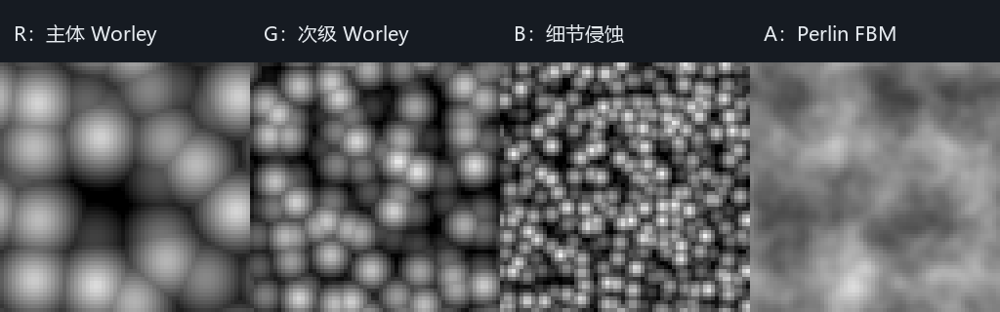

# P1-A C7：离线 3D 云噪声资产与采样合同

> 日期：2026-09-28。源码：`c41e8dd` 基础上的当前工作区，尚未提交。
> 构建：`build-ci-msvc` Release、`build-mingw` Debug。
> GPU：NVIDIA GeForce RTX 4060 Laptop GPU；OpenGL 3.3.0 NVIDIA 591.44。

> 后续状态：C7 的离线 Beer–Lambert LUT 与 Windows 捕获输入清单已完成，见 [`cloud-c7-contract.md`](cloud-c7-contract.md)。本文的未完成项描述保留为该切片完成时的范围记录。

## 目标与范围

本步完成离线噪声生成、文件校验、3D 纹理上传和 CPU/GPU 采样一致性验收，为替换高成本的逐样本程序化 Worley 准备可检查的输入。本篇记录离线资产基础验收；随后生产云 march、云影与 CPU Reference 已接入，并启用两个展示场景，见 [`cloud-offline-runtime.md`](cloud-offline-runtime.md)。光照 LUT 与完整输入 manifest 仍未完成，C7 总项保持未完成。

## 实现：离线生成、读取与上传

`MyRendererCloudNoiseAsset` 是独立 C++ 工具，使用 `MyRendererCloudNoise` CPU 库；生成过程不创建 GL 对象。支持 `32³/64³` 与整数周期 `1..16`，固定哈希与固定梯度，无随机状态。RGBA 四通道依次为现有共享 Worley3 的主体、次级、侵蚀细节，以及独立的三八度 Perlin FBM（分形布朗运动）。RGB 复用 `CloudField.h`；A 不混入当前云形，避免悄悄更换密度定义。

体积覆盖 `[0,period)³`，按体素中心生成，X 最快、然后 Y/Z，以小端 RGBA16 UNORM 保存。格式版本 1 的头部为 `MRCNOISE`、版本、分辨率、周期及 FNV-1a 64 内容指纹，共 `28 B`。指纹覆盖版本、尺寸、周期和全部通道数据；它是内容身份与意外损坏校验，不是安全认证。生成器同时输出 JSON 清单，记录通道、生成器版本、编码、尺寸、周期、指纹与 payload 字节数。CLI 拒绝覆盖已有资产或清单。

`readNoiseVolume` 在返回新值前检查格式/生成器版本、受限尺寸、准确文件长度和指纹。损坏、截断、额外数据或非法维度会抛出错误，调用者已有资源不被覆盖。当前 JSON 是生成器说明清单，读取器验证二进制内的指纹；尚未实现外部受信清单校验或完整场景依赖 manifest。

`NoiseVolume::sample` 与 `cloud_noise_sample.glsl` 共用相同的坐标语义：先归约到周期，再以体素中心定位，显式计算八个 texel 的三线性插值。GPU 使用 `texelFetch`，不依赖驱动对 `GL_LINEAR` 插值精度的选择。负坐标和三个方向的重复边界均纳入验收。

`CloudNoiseTexture` 只在 GL context 线程上传和销毁；CPU 数据可提前生成/读取。上传前验证数据，上传失败保留此前有效纹理；相同指纹不重复上传。上传恢复 active texture 所在单元的 3D 绑定、PBO、alignment、row/image stride、skip offset 和 byte swap。替换当前绑定的旧资产时保持新资源绑定。此资源和采样函数目前由独立 GPU 验收使用，后续已绑定进 `CloudLayerRenderer` / `CloudShadowRenderer`，本篇指标仍是独立资产验收。

### 编译器一致性

首轮测试发现 MSVC 与 MinGW 的全局 `sqrt` 重载选择不同，导致 `64³` 资产中 `866` 个 RGB 通道值相差 `1/65535`。C++ 适配层现在显式选择 `std::sqrt(float)` 和 `std::floor(float)`，与 GLSL float 语义一致；其作用域仅覆盖共享字段，随后立即撤销宏。修复后，两种构建重复生成的二进制和 JSON 清单均逐字节相同。本步没有承诺其他平台或未来编译器的字节一致性。

仓库提供 `assets/clouds/noise-v1-64-period4.cloudnoise` 及相邻 JSON。payload 为 `2,097,152 B`，总文件为 `2,097,180 B`，内容指纹 `4464bd382daa06f7`。两编译器独立生成文件的 SHA256 均为 `1235aa05d72de31eb2f344f6b14a54dd6cd060dc70301d1d38a90687386051c5`。

## 插图：四通道的空间结构

下图是 `64³`、周期 `4` 的 Z 中层切片，四栏分别显示 R/G/B/A，灰度为原始归一化数值。它展示资产的主体、次级、细节和独立 FBM 内容，不能证明生产云渲染已经使用纹理或已经获得性能提升。



复现：用下方 `preview` 命令生成 `256×64` PPM，按 nearest 放大到 `1024×256`，加 `64 px` 标题栏；字体为 Microsoft YaHei，标题依次为“R：主体 Worley”“G：次级 Worley”“B：细节侵蚀”“A：Perlin FBM”。

## 验证

`cloud-noise-asset` 检查同输入重复生成、周期身份、二进制逐值往返、体素中心采样、负坐标/边界周期性、连续重复边界、非法输入、内容损坏、截断、额外数据和错误版本。

`cloud-noise-acceptance` 建立真实 OpenGL 3.3 context，在 `128×64` 网格上对 `32³/64³ × period 3/4/5` 的六组资产逐通道检查 CPU/GPU 采样。四个专用像素覆盖零点、正/负整周期和首体素中心；其余像素跨多个重复周期和高度。GPU 输出为 RGBA32F，采样误差与相对于原程序化主体的近似误差分别报告。

| 分辨率 | 周期 | CPU/GPU 采样最大绝对误差 | 主体场近似 RMSE | 主体场近似最大误差 |
| --- | --- | --- | --- | --- |
| 32³ | 3 | 5.96×10⁻⁸ | 0.004894 | 0.041771 |
| 32³ | 4 | 5.96×10⁻⁸ | 0.007448 | 0.068424 |
| 32³ | 5 | 5.96×10⁻⁸ | 0.010346 | 0.065228 |
| 64³ | 3 | 5.96×10⁻⁸ | 0.003640 | 0.021915 |
| 64³ | 4 | 5.96×10⁻⁸ | 0.005719 | 0.032465 |
| 64³ | 5 | 5.96×10⁻⁸ | 0.008076 | 0.043834 |

采样误差阈值为 `2×10⁻⁵`；`64³/period 4` 主体 RMSE 阈值为 `0.015`。主体定义为 `0.85 R + 0.15 G`，基准是相同位置的原程序化 Worley；这些指标不是完整密度、云剪影或最终画面误差。GPU 测试同时验证非默认 PBO/像素存储状态恢复、非法上传保留旧资源、同内容跳过上传和有效新内容替换。

MSVC Release 全量 CTest **25/25** 通过；MinGW Debug 的 `cloud-noise-asset`、`cloud-reference` 和 `atmosphere-model` **3/3** 通过。两个编译器的 `cloud-noise-acceptance` 均通过。共享数学适配变化后，原有 MSVC `cloud-field-parity` 的 density 最大绝对误差为 `5.81×10⁻⁷`，`cloud-march-parity` 透射率最大绝对误差为 `0.000498`，两项通过，`gpu-smoke` 通过；MinGW 编辑器与相关 CPU/GPU 测试重新构建完成。

工具验收另外生成两份 `64³/period 4` 二进制/JSON，以 SHA256 比较两次输出，并与 GPU 测试实际上传的资产和仓库固定输入比较；已有文件覆盖请求必须失败。输出在构建目录 `cloud-noise-acceptance/`，CPU/GPU 指标见 `metrics.json`，重复性结果见 `repeat-result.json`。

## 限制与取舍

- 纹理是程序化场的离散近似，尤其高频 B 通道不能靠采样一致性证明视觉无损。增加周期而保持分辨率会减少每个细胞的采样点；周期 `1..16` 是文件输入范围，当前画质测量只覆盖 `3/4/5`。
- 未测整帧性能收益。本篇基础验收时生产来源仍为程序化；后续生产云、云影、历史与帧报告已一起接入，见 [`cloud-offline-runtime.md`](cloud-offline-runtime.md)。
- 没有 lighting LUT、authored weather map、完整输入依赖清单或 Scene 中选择噪声资产的 UI。当前 CLI 资产/JSON 发布不是多文件原子事务；失败可能留下不完整产物，已有文件不会自动覆盖或恢复。

## 复现命令

```powershell
cmake --build build-ci-msvc --config Release --target cloud-noise-acceptance
ctest --test-dir build-ci-msvc -C Release -R cloud-noise-asset --output-on-failure
cmake --build build-mingw --target cloud-noise-acceptance
ctest --test-dir build-mingw -R cloud-noise-asset --output-on-failure
# 生成到全新路径，避免覆盖仓库资产。
build-ci-msvc/Release/MyRendererCloudNoiseAsset.exe generate build-ci-msvc/cloud-noise-new.cloudnoise 64 4
build-ci-msvc/Release/MyRendererCloudNoiseAsset.exe verify assets/clouds/noise-v1-64-period4.cloudnoise
build-ci-msvc/Release/MyRendererCloudNoiseAsset.exe preview assets/clouds/noise-v1-64-period4.cloudnoise build-ci-msvc/cloud-noise-channels.ppm
```

## 下一步

生产接入和同配置性能验收已完成，见 [`cloud-offline-runtime.md`](cloud-offline-runtime.md)；后续继续 LUT、完整 manifest 与写实光照标定，C2/C7 总项仍保持未完成。
