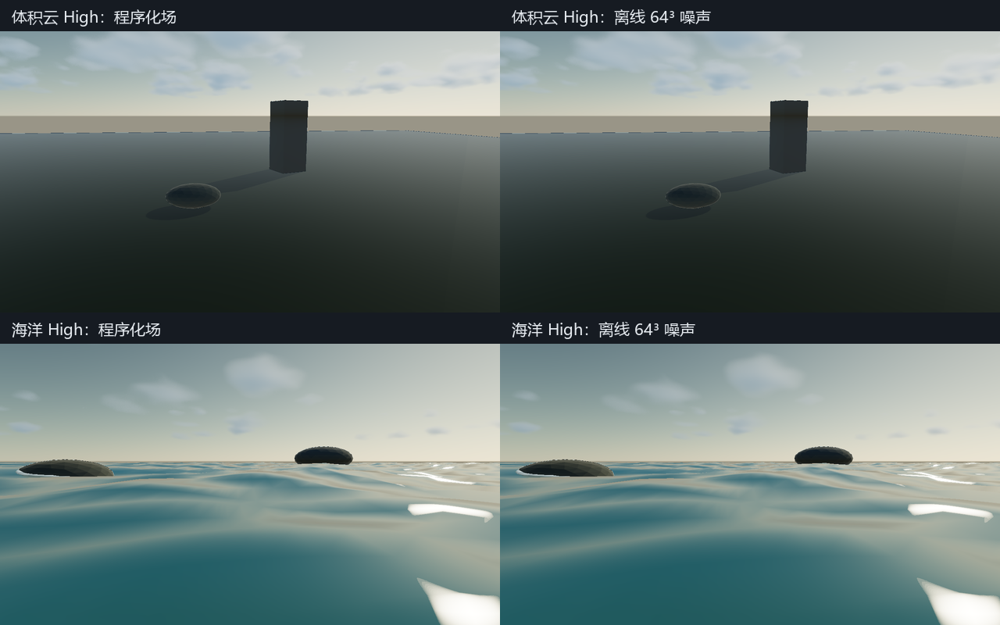

# P1-A C7：离线噪声接入云、云影与 CPU Reference

> 日期：2026-09-28。源码：`c41e8dd` 基础上的当前工作区，尚未提交。
> 构建：`build-ci-msvc` Release、`build-mingw` Debug。
> GPU：NVIDIA GeForce RTX 4060 Laptop GPU；OpenGL 3.3.0 NVIDIA 591.44。

> 后续状态：C7 的离线 Beer–Lambert LUT 与 Windows 捕获输入清单已完成，见 [`cloud-c7-contract.md`](cloud-c7-contract.md)。本文的未完成项描述保留为该切片完成时的范围记录。

## 目标与范围

将已验收的离线噪声实际接入可见云、太阳云影和 CPU Reference raymarch，并记录捕获时使用的资产身份。旧场景保持程序化来源；两个展示场景启用离线来源。本次优化保持云高度、coverage、光照、march 档位及阴影配置，性能测量在同机位、同输入参数下切换噪声来源。

## 实现：声明、校验、共享密度与资源

`.myscene` 新增 `cloudOfflineNoise`，缺省为 false，经编辑器快照、领域命令和运行时设置传递。Inspector 增加“Offline cloud noise”，启用后固定周期为 `4` 并禁用周期滑条；也可用 `MYRENDERER_CLOUD_OFFLINE_NOISE=0/1` 覆盖。显式启用覆盖同时选择周期 4，避免旧周期与固定输入冲突。

当前来源是 `assets/clouds/noise-v1-64-period4.cloudnoise`，64³ RGBA16，预期指纹 `4464bd382daa06f7`。资源按可执行文件目录、当前目录、源码根目录寻找；找到文件后必须通过格式/尺寸/长度/内容指纹验证并匹配预期身份，不静默回退。Scene 加载及 Inspector 命令在提交设置前完成 CPU 校验，非法周期或资产校验失败不会替换当前有效 Scene/设置。

`canonicalNoiseVolume()` 只加载一次，返回整个进程共用的不可变 CPU 数据。CPU worker 和 SceneSnapshot 环境生成消费同一数据，已生成的环境像素随 Snapshot 保持不可变。运行期间不监听文件变化，也不热替换固定资产；修改磁盘文件后需重启并重新校验。当前版本没有任意路径的 authored noise import。

共享密度字段仍执行同一 weather map、高度剖面、coverage 重映射、侵蚀权重与风场偏移。离线来源只替换主体/次级/细节的 Worley 求值，采样位置保持 `(tileX,tileZ,2*taper)`，主体仍为 `0.85 R + 0.15 G`，侵蚀仍为 B；A 的 Perlin FBM 未混入生产密度。GPU 和 CPU 使用上一阶段验收的显式三线性采样。

`CloudLayerRenderer` 的主 march 与 sun light march、`CloudShadowRenderer` 的太阳透射率、`cloud::densityAt/march/shadowTransmittance` 以及解析 CPU 环境投影均走同一个来源开关。CPU Reference raymarch 已与 GPU 数值交叉验证；CPU Path Tracer 的天空仍采用现有解析云投影，并不是完整 GPU 体积积分，不能据此宣称最终 CPU/GPU beauty 图相同。

每个 GPU 消费者首次使用时上传一次固定纹理，后续帧不读取文件、不重新遍历数据计算哈希、不重新上传。两份纹理共 `4 MiB`，计入渲染显存估算；退出离线模式后纹理保留供再次启用。资源创建、上传与销毁在 context 线程执行；上传状态恢复沿用 `CloudNoiseTexture` 的独立验收合同。

切换来源会通过完整大气参数比较失效云历史；尺寸、相机切换与热重载等现有失效规则保留。来源变化不参与 cloudless sky/IBL 的缓存键，不重新引入移动相机或修改云参数时的天空烘焙停顿。

### 帧报告

Raster 帧报告现在按实际来源填写 `densitySource`。离线模式记录 `offline-rgba16-shared-field`，`offlineAssets` 包含资源名、实际内存数据的指纹、算法、生成器版本、分辨率、周期和编码；weather 仍明确记录为程序化来源。程序化模式继续记录 `procedural-shared-field` 与空资产数组。完整模型、纹理、shader 依赖 manifest 和 lighting LUT 仍未完成，C7 总项保持未完成。

## 截图

下面两组固定 High 档位、太阳、相机和风偏移，左为程序化场，右为离线噪声。主要云形和海面云影保持接近；误差来自体素量化和插值。插图没有更新历史回归基线，也不能作为已经达到写实云/海洋目标的证明。



复现：`cloud-offline-production-acceptance` 输出两个 scene 的 `*-high-0.png` / `*-high-1.png`，各缩为 `640×360`，按两行两栏拼接并增加 `40 px` 中文标题栏。

## 验证与性能

CPU 固定 `32×24×12` 空间采样下，完整 density 相对程序化场 RMSE 为 `0.006076`，占据区域 IoU 为 `94.886%`，阈值分别为 `0.015` 和 `90%`。该指标包含 weather/profile/coverage/erosion，区别于前一阶段只测主体噪声的 RMSE。

离线来源 GPU/CPU 云 march 透射率最大绝对误差为 `0.000510`，radiance 最大绝对误差为 `0.015841`；云影 Low/High 最大绝对误差为 `0.000481/0.000488`。`cloud-temporal-acceptance` 验证来源切换清空旧历史、固定资产连续绘制复用历史。

性能对照固定 `1280×720`、Hybrid Deferred、4×MSAA、半分辨率云、太阳云影/光束开启；determinism 开启，云历史、几何 TAA、bloom 关闭，水面时间固定 `1.25 s`。每组预热 `16` 帧、测量 `60` 帧，GPU 工作负载串行执行。该配置用于隔离噪声来源，不等于默认编辑器 FPS。

| 场景 / 档位 | 程序化整帧 GPU P50 / P95 | 离线整帧 GPU P50 / P95 | P50 加速 |
| --- | --- | --- | --- |
| 云 Lab Low | 5.717 / 6.339 ms | 3.124 / 5.601 ms | 1.83× |
| 云 Lab High | 14.631 / 16.172 ms | 7.244 / 7.522 ms | 2.02× |
| 海洋 Low | 5.317 / 5.748 ms | 3.277 / 3.939 ms | 1.62× |
| 海洋 High | 12.638 / 13.072 ms | 6.579 / 7.273 ms | 1.92× |

High 云 march P50 分别从 `9.103/7.420 ms` 降至 `4.227/3.598 ms`（云 Lab / 海洋），云影从 `4.619/4.206 ms` 降至 `2.083/2.024 ms`。Low 的尾延迟波动仍较明显，不把这些实测外推为任意分辨率、显卡或运动视角下的帧率承诺。

四组 PNG 的归一化 MAE 为 `0.000161..0.000922`，超过 `8/255` 差异阈值的像素占比最大为 `0.000326%`；验收上限为 MAE `0.02` 与像素占比 `10%`。完整 CPU 占据 IoU、最终画面 MAE 和 GPU 性能分别检验不同风险，不能互相替代。既有云 benchmark/视觉目标显式固定程序化来源，保留历史阶段对照的输入语义。

MSVC Release 全量 CTest `25/25` 通过。确定性 Render Job 的 `15` 组 PNG/报告通过重复、预热不变性和时间积累重复验证，并逐帧检查离线资源身份。Scene 回归覆盖新字段往返、旧场景默认 false，以及周期冲突的事务性拒绝；报告回归检查来源与指纹。

MinGW Debug 重点 CTest `4/4`（cloud-reference、atmosphere-model、scene-document、raster-capture）通过。两个编译器的离线云 march、离线云影与来源切换历史 GPU 检查均通过。MSVC `gpu-smoke` 和 `1100×680` 缩略图布局通过，Viewport 为 `538×322`，实际上传 `2` 张缩略图。

默认 High/云历史/TAA 配置下，`camera-environment-acceptance` 每帧升高 `2 m` 并旋转，固定 `1280×720`。MinGW Debug 移动 CPU P50/P95 云 Lab 为 `7.549/9.381 ms`、海洋为 `6.841/8.429 ms`；两场景只有进入场景时的 `1` 次天空重建。此前相同移动检查的程序化来源 P50 为 `16.902/14.227 ms`，该跨运行对照用于记录实际编辑器成本，不能替代上表同版本隔离 GPU 对照。

## 限制与取舍

- 当前离线输入只支持固定 64³、周期 4；任意 authored noise/weather、分辨率选择和热替换没有接入。
- 云的光照模型和云形预设保持原值，没有因为性能优化就完成写实光照标定。纹理是离散近似，其他视角/高频细节仍需测量。
- lighting LUT、完整输入依赖 manifest 和真实日月星历仍待后续工作；本步没有将 C2/C3/C5/C7 总项勾选为完成。
- 磁盘上的资源修改不会改变正在运行的不可变场；重启后身份不匹配会拒绝加载。新增不同资产应有新的版本/身份和验收，而不是覆盖这个固定输入。

## 复现命令

```powershell
cmake --build build-ci-msvc --config Release --target cloud-offline-production-acceptance
cmake --build build-ci-msvc --config Release --target cloud-determinism-acceptance cloud-temporal-acceptance camera-environment-acceptance --parallel 1
ctest --test-dir build-ci-msvc -C Release --output-on-failure
# 程序化对照，保留其他作者参数。
$env:MYRENDERER_CLOUD_OFFLINE_NOISE='0'
build-mingw/MyRenderer.exe assets/scenes/02_ocean_weather_hero.myscene
Remove-Item Env:MYRENDERER_CLOUD_OFFLINE_NOISE
# 离线来源是两个展示场景的默认值。
build-mingw/MyRenderer.exe assets/scenes/02_ocean_weather_hero.myscene
```

输出位于对应构建目录的 `cloud-offline-production-acceptance/`，包括八组 PNG、帧/分 pass JSON、比较结果及离线云影证据。
