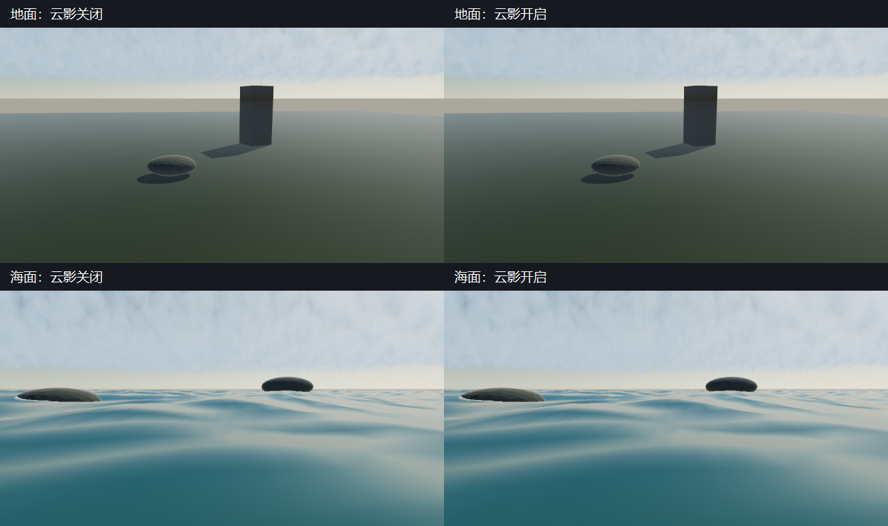
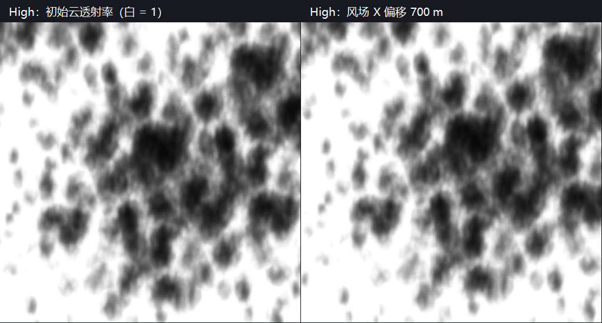

# P1-A C6：地面与海面云阴影

> 日期：2026-09-28。源码：`c41e8dd` 基础上的当前工作区，尚未提交。
> 构建：`build-ci-msvc` Release、`build-mingw` Debug。
> GPU：NVIDIA GeForce RTX 4060 Laptop GPU；OpenGL 3.3.0 NVIDIA 591.44。

## 目标与范围

本步让共享体积云密度遮挡直射太阳光，并将阴影接入地面和海面。云形、风场和太阳方向复用已有大气参数。C6 后续屏幕空间 god rays（径向光束）实现与漏光病例见 [`god-rays.md`](god-rays.md)。

## 实现：太阳透射率到场景光照

`cloudShadowsEnabled` 经 `.myscene`、`EditorSession`、领域快照和场景应用传入 `AtmosphereParameters`。旧场景缺字段时默认关闭，两个可见场景默认开启。Inspector 的“云阴影”和 `MYRENDERER_CLOUD_SHADOWS=0/1` 可以切换；全局阴影关闭也会跳过该 pass。

`CloudShadowRenderer` 在上下文线程生成一张太阳正交投影的 `R16F` 透射率图。每个 texel 沿共享 `sunDirection` 对 cloud base 到 top 的完整 slab 积分，使用 `CloudField.h` 的相同密度、风偏移及消光系数；透射率为 `exp(-extinction × opticalDepth)`。这里没有相机 march 的距离截断或地平线淡出，避免视点改变太阳遮挡。

| 档位 | 阴影图 | 完整 slab 积分步数 | 纹理占用 |
| --- | --- | --- | --- |
| Low | 128×128 | 24 | 32 KiB |
| High | 256×256 | 48 | 128 KiB |

投影中心跟随相机并吸附到世界 texel 网格，微小相机移动不会改变采样点。正交半宽为 `max(camera.farPlane × 1.5, water.extent × 1.1)`；边界 3% 平滑回到透射率 1。太阳高度对应 `sun.y <= 0.02` 时跳过，实际关键光与太阳不一致时也跳过，避免太阳云影调制月光。该图每帧重算，无历史残留；生产路径没有 GPU 同步回读。

顶层 `Cloud sun transmission` pass 经 `RenderPassContext` 声明尺寸和状态，并由现有 pass 序列恢复状态。Forward、Deferred 和 Forward water 共用 `cloud_shadow_sample.glsl` 的世界位置投影，只处理 cloud base 以下接收点。地面仅衰减直射光，保留 IBL 环境光。水面衰减太阳高光、泡沫的太阳部分，以及原有艺术化水体底色的 65% 太阳份额；保留其 35% 环境底色及真正的 irradiance/reflection IBL。这一底色拆分是近似，不是水下多次散射模型。

本次非 2 次幂周期测试还暴露了 GLSL 3.30 中负整数 `%` 结果未定义的问题。共享 Worley 字段改为先对非负整数取模，再恢复欧几里得余数。GPU 验收固定 `cloudNoisePeriod=5`，覆盖默认周期 4 隐藏的负坐标错误。

## 截图

固定机位开关对照显示地面与水面被云影调制，环境光仍保留。这个机位看到的地面范围远小于云团尺寸，因此亮度变化较轻，并非清晰的局部云影轮廓；不能用它宣称达到写实海洋目标。



复现：`cloud-shadow-visual-acceptance` 输出 `ground_off/on.png`、`water_off/on.png`，各缩到 640×340，按地面/海面两行拼接并加 40 像素中文标题栏。

太阳投影图展示较大范围内的实际阴影结构；风场 X 偏移 700 m 后，High 档透射率图 MAE 为 0.186550，白色表示无遮挡。



复现：`cloud-shadow-acceptance` 的 `high-base.ppm` 与 `high-wind.ppm` 按 nearest 放大到 512×512，横向拼接，加 38 像素标题栏。

## 验证

`cloud-shadow-acceptance` 在真实 OpenGL 上读取测试图，与 `cloud::shadowTransmittance` 的 CPU 太阳积分对照。Low/High 最大绝对误差分别为 **0.000484765 / 0.000488400**，低于 0.002 合同；风场图 MAE 分别为 **0.187276 / 0.186550**。测试还覆盖亚 texel 相机稳定性、太阳方位变化、清空覆盖率立即得到全 1、夜间与关闭开关跳过，以及 GL 错误检查。

`cloud-shadow-visual-acceptance` 的 960×540 对照：地面/海面开关 MAE 为 **0.000866202 / 0.000348864**；开启云影的 Forward/Deferred MAE 为 **0.001349630 / 0.000170470**，低于 0.008 合同。同配置重复海面帧与夜间开关对照的 MAE 均为 **0**。

MSVC Release 全量 CTest **23/23**、MinGW Debug 重点 CTest **5/5** 通过。两个编译器的 `cloud-shadow-acceptance` 通过；共享云密度、march 与 temporal GPU 回归继续通过。`gpu-smoke` 与 `asset-thumbnail-layout-acceptance` 通过，1100×680 下实际上传 2 张 raster 缩略图。旧云层与云历史验收/benchmark 显式关闭新云影，保留各阶段比较的含义。

`cloud-shadow-benchmark` 在同一海洋场景、1280×720、半分辨率云和独立云历史开启时，预热 16 帧、测量 60 帧，记录独立 pass 的 GPU 查询结果。关闭云影时没有该 pass。测量串行执行，构建目录 JSON 保留完整帧和其他 pass 的计时；Low 与 High 同时改变云 march 档位，因此不把整帧差值当作阴影独立开销。

| 阴影档位 | 独立 pass GPU P50 | 独立 pass GPU P95 |
| --- | --- | --- |
| Low | 0.708 ms | 1.791 ms |
| High | 4.395 ms | 4.630 ms |

High 每帧额外约 4.6 ms，尚不能视为低成本。后续可以研究降低更新频率或使用可验证的空区跳过，但本步保留直接重算来保证编辑器参数变化立即生效。

## 限制与取舍

- 这是有限正交范围内、cloud base 以下接收面的完整 slab 积分。云内物体、多个独立高度云层和月亮云影尚未支持。
- Low/High 固定步数可能漏采很薄的密度层；低太阳高度时射线变长，本步采用高度门槛跳过，没有自适应步数。
- 太阳方向变化会改变正交基；网格吸附只保证固定太阳方向下的小幅相机稳定性，没有阴影时间滤波。
- 水体底色的太阳份额是艺术近似；水下散射、焦散的能量一致性和云影对环境探针的局部遮挡仍需后续工作。
- 屏幕空间 god rays 的独立验收及遮挡边缘漏光见 [`god-rays.md`](god-rays.md)。不同 GPU/驱动逐像素一致性未验证。

## 复现命令

在仓库根目录 PowerShell 中串行运行，避免同时运行 GPU 工作负载污染性能证据：

```powershell
cmake --build build-ci-msvc --config Release --parallel 4
ctest --test-dir build-ci-msvc -C Release --output-on-failure
cmake --build build-ci-msvc --config Release --target cloud-shadow-acceptance cloud-shadow-visual-acceptance --parallel 1
cmake --build build-ci-msvc --config Release --target cloud-shadow-benchmark --parallel 1
cmake --build build-ci-msvc --config Release --target cloud-field-parity cloud-march-parity cloud-temporal-acceptance gpu-smoke asset-thumbnail-layout-acceptance --parallel 1
cmake --build build-mingw --target MyRenderer MyRendererCloudTests MyRendererSceneDocumentTests MyRendererCloudShadowTests --parallel 4
ctest --test-dir build-mingw --output-on-failure -R 'cloud-reference|cloud-shape|scene-document|atmosphere|camera-navigation'
cmake --build build-mingw --target cloud-shadow-acceptance --parallel 1
```

输出位于构建目录的 `cloud-shadow-acceptance/`、`cloud-shadow-visual-acceptance/`、`cloud-shadow-benchmark/`。截图是说明性素材，不更新版本化回归基线。

## 下一步

云阴影与 god rays 完成 C6 的实现范围；继续 [`todolist.md`](../todolist.md) 的 C7 正式确定性模式与 Render Job 元数据。
