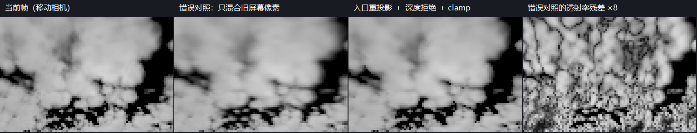
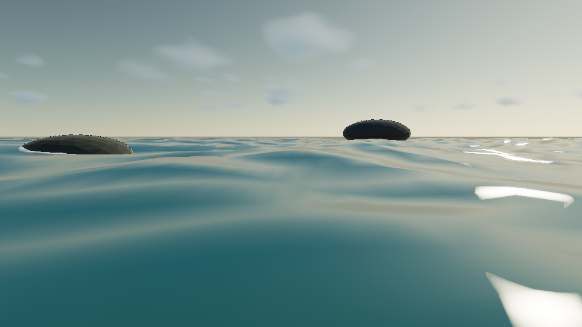

# P1-A 切片 6 C4：半分辨率与独立云历史

- 日期：2026-09-28
- 源码 revision：`c41e8dd` 加工作区改动，尚未提交
- 构建：`build-ci-msvc`，MSVC Release；`build-mingw`，MinGW Debug
- GPU / 驱动 / OpenGL：NVIDIA GeForce RTX 4060 Laptop GPU / NVIDIA 591.44 / OpenGL 3.3.0

## 目标与范围

在上一阶段的[云场标定](cloud-calibration.md)基础上，降低三维程序化密度场的逐帧成本，并用独立体积历史降低采样闪烁。实现遵循 OpenGL 3.3 fragment pass 路径，不需要 compute shader。

C4 已完成半分辨率 march、云自身深度引导升采样、入口处风场重投影、深度拒绝和邻域 clamp。云的历史只包含 radiance/transmittance（辐亮度与透射率），不会混入几何 TAA 的场景颜色。写实光照、云影与离线 3D 噪声纹理仍不属于本阶段。

## 实现

### 持久化、运行时与 UI

`AtmosphereParameters` 增加 `cloudHalfResolution` 与 `cloudTemporalEnabled`，经 `.myscene`、`EditorAtmosphereSettingsPayload`、领域快照和应用命令进入 renderer。旧文件缺少字段时均为 `false`，保留全分辨率固定抖动路径。两个默认场景显式启用两个字段，Inspector 提供「云半分辨率」与「云时间累积」独立开关。

`MYRENDERER_CLOUD_HALF_RESOLUTION=0/1` 和 `MYRENDERER_CLOUD_TEMPORAL=0/1` 可用于验收覆盖。Low/High 仍分别为 `24/4` 与 `48/6` 步，不改变 weather map 或云形。CPU 参考始终积分同一原始云场，不使用屏幕空间历史。

### 云缓冲与深度

`CloudLayerRenderer` 将 `W×H` 输出映射到 `ceil(W/2)×ceil(H/2)`，使用原输出的宽高比生成相机射线，避免奇数尺寸改变视野。RGBA16F 保存 radiance/transmittance，RG32F 保存首个非零密度样本距离和 slab 入口距离；射线没有有效密度时深度为零。

`Cloud volume march` 声明体积颜色和深度输出、实际低分辨率视口及无深度测试/写入状态。时间 resolve 使用两个独立颜色/深度 FBO 交替写入，不会读写同一纹理。全部 OpenGL 创建、绘制和销毁仍在 context 线程执行，生产绘制继续跳过同步诊断回读。

最终 composite 以最近云深度为参考，对周围四个低分辨率样本施加双线性权重和深度权重；无云与有云样本不混合，距离相差较大的云体降低权重。opaque depth 仅用于判断前景是否在云体前方，不参与云的升采样权重。合成在 tone mapping 前，前景不会进入云历史。

### 风场运动与时间 resolve

云密度读取的是 `worldPosition + windOffset`。同一云特征在上一帧的位置因此是 `currentPosition + currentWind - previousWind`。使用当前射线在 slab 入口处的位置加该位移，经上一帧相机矩阵生成历史 UV；首个有效密度的位置则用于预估上一帧到云体的距离。

历史 UV 越界、上一帧无云或体积深度偏差超过 `max(50 场景单位, 预期深度×12%)` 时拒绝历史。接受的历史颜色和透射率先被当前 `3×3` 邻域的 min/max 限制，再以 `0.85` 权重混合。当前射线无云时直接输出当前值。

时间累积开启后，像素整数 hash 使用固定的 `1024` 帧循环序列。它不依赖墙钟；首次有效帧和历史失效后均从索引零开始。关闭时间累积后抖动固定为单帧序列。

### 历史失效

正常相机移动和连续风场位移进行重投影。大幅视角切换（前向点积 `<0.9`）、相机位置或风场跳变超过 `featureScale×0.25`、FOV 改变、输出尺寸变化、云形/质量/积分/光照参数改变时重新开始历史。奇数输出尺寸变化即使低分辨率尺寸相同，也会使历史失效。

云关闭、调试视图跳过云 pass、Forward/Deferred 切换、场景与 shader 输出失效均拒绝旧历史。热重载成功会同时失效几何与云历史。窗口缩放、关闭重开和显式失效后的首帧必须与当前原始 march 完全一致。

## 截图



图：High 验收从 `192×128` 输出生成 `96×64` 云缓冲，每帧横移 `40` 场景单位并改变 wind X `8` 单位，共 `12` 帧。第二栏是测试在 CPU 上构造的错误对照：直接混合旧屏幕像素，完全不做重投影、深度拒绝或 clamp；不是 renderer 的可选模式。第四栏显示该错误对照与当前帧的透射率差异乘 `8`。第三栏保留当前云结构，仍存在有限采样与时间混合误差。

复现：`cloud-temporal-acceptance` 输出 `high-moving-{raw,naive,resolved,naive-error}.ppm`；各以 nearest 放大到 `384×256`，横向拼接并加 `38` 像素标题栏。PPM 的 RGB 使用 `value/(1+value)` 和 gamma `2.2` 显示变换，不代表最终场景曝光。



图：Hero 在 `960×540`、几何 TAA 关闭、云 High、固定动画时间 `1.25`、预热 `8` 帧时的最终合成。云历史没有进入近景海面和礁石；云的光照仍偏平，写实细节不因本阶段优化而自动完成。复现 `cloud-temporal-visual-acceptance`，复制其 `hero.png`。

## 验证

### 稳定视角与运动

`cloud-temporal-acceptance` 在 MSVC Release 和 MinGW Debug 均通过。固定相机先运行 `4` 个后续预热帧，再统计 `16` 次相邻帧透射率 MAE；原始与 resolve 使用同一帧的抖动样本，因此减少的不是采样预算或风场变化。

| 档位 | 原始帧间变化 | resolve 帧间变化 | 降幅 | 运动时 resolve 对当前帧最大 MAE | 错误历史对照末帧 MAE |
| --- | --- | --- | --- | --- | --- |
| Low | 0.023099 | 0.005982 | 74.1% | 0.036105 | 0.071161 |
| High | 0.006464 | 0.001227 | 81.0% | 0.034732 | 0.068380 |

测试要求稳定视角变化至少下降 `35%`，运动期间透射率 MAE `<0.06`。这里的运动误差是相对于当前有限步数 march，不是相对于无限采样真值；它约束残留历史的规模，不能证明所有运动都没有 ghosting。

测试另验证首帧拷贝、云深度命中与入口顺序、正常相机/风场移动复用、大幅风场跳变、云密度移除、相机切换、奇数尺寸、显式失效、关闭重开及历史关闭后的逐值重复性。清空密度后所有透射率立即为 `1`，历史不能保留旧云。没有 OpenGL error。

### 最终合成与编辑器

`cloud-temporal-visual-acceptance` 固定 `8` 帧预热，High 两次独立进程截图 MAE `0`；半分辨率/历史 High 相对全分辨率固定抖动对照的整图 MAE 为 `0.000110829`。整图 gate 为 MAE `≤0.02`、差异像素比例 `≤8%`，它只验证最终合成；云区域的时间稳定性仍由上面的独立 GPU 测试约束。

MSVC 全量 CTest `23/23`，新旧场景序列化检查通过；MinGW 相关 CTest `5/5`。`cloud-march-parity` 的透射率最大误差维持 `0.000498116`。`gpu-smoke` 和 `asset-thumbnail-layout-acceptance` 通过，`1100×680` 下显示两个场景、viewport 为 `538×322`，完成两个缩略图上传。没有改写版本化回归基线。

### 同版本 GPU 成本对照

两个 benchmark target 顺序执行，固定云 Lab、Hybrid Deferred、4×MSAA、`1280×720`，关闭几何 TAA 与 bloom，预热 `16` 帧、测量 `60` 帧。全分辨率对照关闭云时间历史；C4 开启半分辨率和独立历史。C4 的云 pass 时间包含 march 与 resolve 两次绘制。

| 档位 | 全分辨率云 pass P50 / P95 | C4 云 pass P50 / P95 | 全分辨率整帧 P50 / P95 | C4 整帧 P50 / P95 |
| --- | --- | --- | --- | --- |
| Low | 11.995 / 13.071 ms | 3.604 / 4.157 ms | 13.337 / 14.489 ms | 4.917 / 5.476 ms |
| High | 26.294 / 28.375 ms | 8.300 / 9.003 ms | 28.127 / 29.749 ms | 9.701 / 10.468 ms |

云 pass P95 两档分别下降约 `68.2%` 与 `68.3%`。这是当前 GPU/驱动上的测量，其他硬件仍需重新测量。此前与另一项 GPU 验收重叠的测量没有用于最终对照；最终日志为 `cloud-c4-isolated-benchmark.log`。

## 移动卡顿修复：天空环境缓存

2026-09-28 检查发现，云层已经改成独立 GPU march，但 Renderer 仍沿用旧云 cubemap 的缓存规则：摄像机高度变化超过 `1 m` 就同步重建解析天空及 IBL。`build-mingw` Debug 的首次重建实测为 `3702.89 / 3760.48 ms`（云 Lab / 海洋）；旧规则会在移动时重复支付同样的重建工作。这不是海面网格自身的开销。

现在 `environmentParametersMatch` 只比较解析天空实际使用的太阳、浑浊度、天空/太阳强度、地面反照率与夜空参数。摄像机位置、云层参数与 Aerial Perspective 由每帧 pass 处理。完整 `parametersMatch` 仍用于云时间历史和 CPU 派生缓存，保留它们的失效语义。两个 scene 的 High 档、阴影和光束配置保持原值。

`camera-environment-acceptance` 使用同一台 RTX 4060 Laptop、NVIDIA `591.44`、OpenGL `3.3`，固定 `1280×720`、`4×MSAA`，预热 `8` 帧、采样 `40` 帧，每帧竖直移动 `2 m` 并旋转镜头。`build-mingw` Debug 的结果如下；每个 scene 均只有进入场景时的 `1` 次天空重建。

| 场景 | 移动 CPU P50 | 移动 CPU P95 |
| --- | --- | --- |
| 云 Lab | 16.902 ms | 18.696 ms |
| 海洋 | 14.227 ms | 22.966 ms |

回归会检查重建计数为 `1`，且 CPU P95 不超过 `200 ms`，用来捕获同步重建停顿；该宽松阈值不是目标帧率。`atmosphere-model` 同时检查云参数编辑不失效天空缓存，而太阳/夜空输入会失效。MSVC Release 全部 `24` 项 CTest 和 MinGW 的 `atmosphere-model`、`camera-navigation` 通过。

```powershell
cmake --build build-mingw --target camera-environment-acceptance
cmake --build build-ci-msvc --config Release --target camera-environment-acceptance
```

日志和 CPU/GPU 分项报告保存在对应构建目录的 `camera-environment-acceptance/`。单次进入场景的同步 IBL 重建仍存在，编辑太阳也会触发它；本次修复消除的是摄像机运动与云参数变化造成的无效重建。当前云 march 和每帧云影依然是主要 GPU 开销，不能据此宣称所有分辨率都达到固定帧率。

## 限制与取舍

单个入口运动向量不能精确描述厚云中每一层的视差。大幅运动、薄边和多个云体重叠仍可能出现短暂拖影；深度拒绝和邻域限制控制它们，但不等于完整体积 motion field。首个非零密度深度也会随采样抖动变化，因此当前使用容差而非逐值匹配。

升采样依赖低分辨率自身深度，不能恢复低分辨率完全漏掉的细小云体。天空反射仍使用解析环境捕获，未做历史过滤后的云反射一致化。云内部的照明层次、云影、god rays、authored weather map 与 3D 噪声纹理仍未完成。

关闭时间历史时固定截图可重复；开启历史时必须固定预热帧数才能比较。本阶段使用现有截图预热控制，正式 Render Job 的 determinism/历史元数据合同仍属于 C7。

## 复现命令

```powershell
cmake --build build-ci-msvc --config Release --target cloud-temporal-acceptance
cmake --build build-ci-msvc --config Release --target cloud-temporal-visual-acceptance
cmake --build build-ci-msvc --config Release --target cloud-layer-benchmark cloud-temporal-benchmark
ctest --test-dir build-ci-msvc -C Release --output-on-failure
cmake --build build-mingw --target cloud-temporal-acceptance
```

输出分别位于构建目录的 `cloud-temporal-acceptance/`、`cloud-temporal-visual-acceptance/`、`cloud-layer-benchmark/` 和 `cloud-temporal-benchmark/`。不要同时运行多个 GPU benchmark 或验收来比较耗时。

## 下一步

地面与水面云阴影及屏幕空间光束已接入，见 [`cloud-shadows.md`](cloud-shadows.md) 和 [`god-rays.md`](god-rays.md)。继续 [`todolist.md`](../todolist.md) 的 C7 正式确定性控制与 Render Job 元数据；写实光照和细节仍需单独标定。
