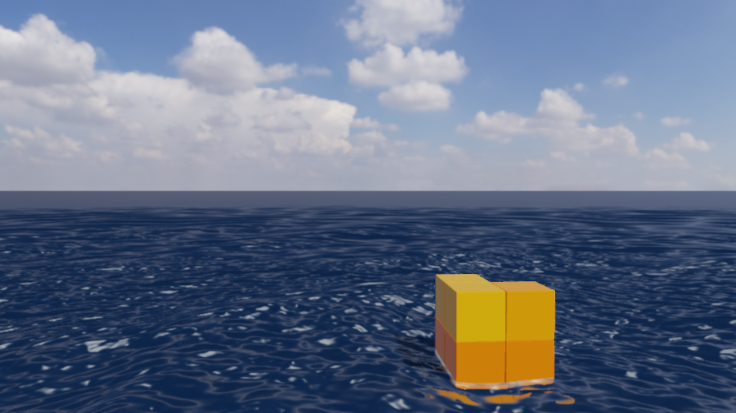
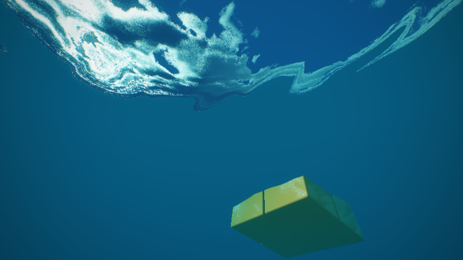

# Enscape Cube GLSL 海面研究场景

`assets/scenes/03_enscape_ocean_study.myscene` 现在直接运行用户提供的 [Enscape Cube](https://www.shadertoy.com/view/4dSBDt) 四段 GLSL：Buffer A 生成云、海面和方块；Buffer B 做泛光与 ACES；Buffer C 做时域抗锯齿；Image 做最终色散与暗角。该模式只在本场景启用，可在 Inspector 的 **Lighting & environment → Enscape Cube GLSL study** 切换。其他 `.myscene` 沿用原渲染管线，`02_ocean_weather_hero.myscene` 未修改。

四段源码及 OpenGL 3.3 包装放在 `shaders/third_party/enscape_cube/`。源文件注明 **CC BY-NC-SA 3.0**，并署名 Thomas / @Thomas_ensc；海面部分引用 Alexander Alekseev（TDM）的 Seascape。此目录独立于项目 MIT 许可，详情见该目录的 `LICENSE.md` 和根目录 `THIRD_PARTY_NOTICES.md`。原 Shadertoy 的纹理通道资源没有随文本提供，运行时生成固定种子的 256² 天气纹理和 32³ 噪声纹理，因此不会逐像素等同原作。

方块仍是 Buffer A 内的 SDF，与编辑器实体/物理系统没有连接，也不随波浪做浮力运动。海面、折射和接触效果仍按原 GLSL 绘制。该模式使用自己的时域抗锯齿，渲染目标按 1× 分配。

相机射线现在由项目 `Camera` 的位置、前/右/上基向量及 FOV 生成，因此编辑器的轨道旋转、平移、WASD 移动、Shift 下降、Space 上升、缩放和 FOV 设置都会改变 GLSL 画面。示例场景保存了与参考构图接近的初始机位和左侧日光。相机矩阵、视口大小、时间或 GLSL 参数变化时会清除 TAA 历史，避免移动中的旧画面残影。相机下潜时改用简化水下透射与雾色分支，避免原代码在水面下出现灰色空白；这不是完整的水下物理模拟。

Inspector 的 **Lighting & environment → GLSL 海面参数** 可调整波高、波纹频率、波峰陡度、波速、云量、反射强度、太阳方位/仰角、泛光和曝光。数值随 `.myscene` 保存与重新加载。普通渲染路径的 SSAO、HDRI 天空盒和海面滑块仍不作用于此独立 GLSL 模式。





水下图用同一场景的临时副本，将 `camera.target.y` 改为 `-1.2`，保持 yaw、pitch、distance 不变；以同样的 `920×517` 截图命令采集，TAA 预热 2 帧。

图示在 NVIDIA RTX 4060 Laptop、OpenGL 3.3、`920×517`、保存时间 `1.25 s`、TAA 预热 4 帧后采集：

```powershell
$env:MYRENDERER_SMOKE_TEST='1'
$env:MYRENDERER_RENDER_WIDTH='920'
$env:MYRENDERER_RENDER_HEIGHT='517'
$env:MYRENDERER_ANIMATION_TIME='1.25'
$env:MYRENDERER_SCREENSHOT='docs/media/p1a-enscape-ocean-study.png'
$env:MYRENDERER_SCREENSHOT_WARMUP='4'
build-ci-msvc/Release/MyRenderer.exe assets/scenes/03_enscape_ocean_study.myscene
```

Buffer A 逐像素执行云层积分与海面高度场追踪，实时成本明显高于原网格海面路径；本阶段以视觉与交互验证为先。
