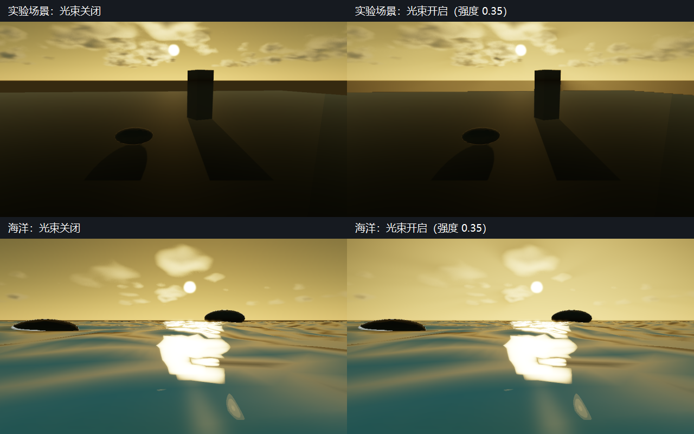
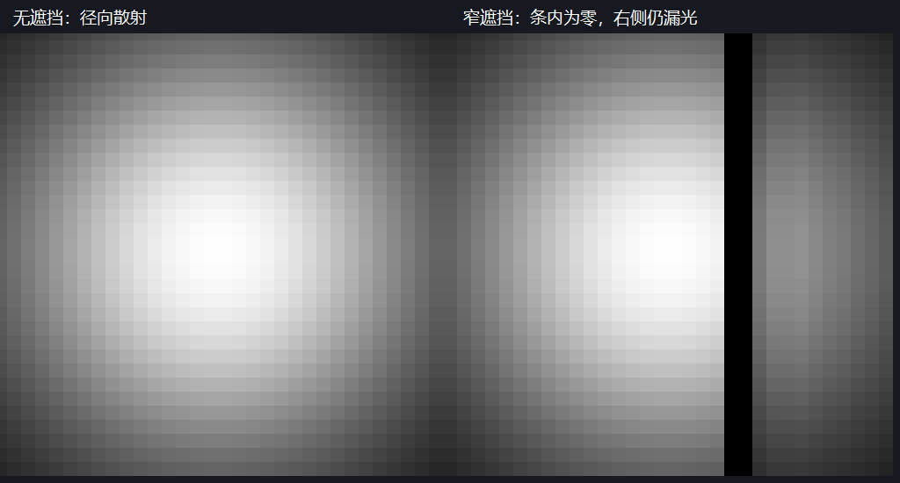

# P1-A C6：屏幕空间云隙光束

> 日期：2026-09-28。源码：`c41e8dd` 基础上的当前工作区，尚未提交。
> 构建：`build-ci-msvc` Release、`build-mingw` Debug。
> GPU：NVIDIA GeForce RTX 4060 Laptop GPU；OpenGL 3.3.0 NVIDIA 591.44。

## 目标与范围

在已有[地面与海面云阴影](cloud-shadows.md)上接入 god rays（云隙径向散射光束），完成 C6 的屏幕空间实现。本步没有三维空气体积积分，也不宣称解决屏幕空间遮挡边缘漏光。

## 实现：透射率、径向采样与合成

`cloudGodRaysEnabled` 与 `cloudGodRaysStrength` 经 `.myscene`、编辑器领域快照、场景应用和 `AtmosphereParameters` 传递；强度限制在 0～1。旧场景缺字段时默认关闭，默认强度 0.08；两个可见场景开启。Inspector 提供“云隙光束”和“光束强度”，命令行环境变量为 `MYRENDERER_CLOUD_GOD_RAYS` 与 `MYRENDERER_CLOUD_RAY_STRENGTH`。

`GodRaysRenderer` 在云 march 后运行独立 `Cloud god rays` pass，使用向上取整的半分辨率 `R16F` 缓冲。Low/High 分别使用 24/48 个径向采样。太阳以方向向量投影，不使用一个有限距离的假太阳；太阳在镜头后方或屏幕外时跳过，在屏幕内侧 8% 范围平滑淡出。

每个径向采样读取场景深度与云颜色缓冲的 alpha 透射率，并重建对应世界视线，在 `camera.farPlane × 0.5` 的采样位置复用太阳正交云透射率图。带指数权重的径向平均再乘以围绕太阳的衰减函数，产生标量散射强度。这里的视线距离和权重是艺术近似，没有真实散射系数或能量守恒保证。

最终在云合成之后、色调映射之前加入散射颜色，使用实际大气太阳关键光的颜色和缩放后的 `diffuseStrength`，所以太阳强度会影响光束。半分辨率和全分辨率合成两处都使用天空深度掩码，防止光束直接覆盖前景物体；这个版本仅在天空区域合成。它不表示物体前方空气中的光束。

夜间、云/大气/云影/全局阴影关闭、强度为零、镜头进入云层或水下时跳过。结果没有时间历史，每帧更新；关闭开关或移出视野时，合成标志同步关闭，不读取上一帧光束。资源在 OpenGL 上下文线程创建、调整尺寸和销毁，pass 尺寸与状态由现有 `RenderPassContext` 序列管理。计时和纹理估算进入现有 Profile。

## 截图

同机位太阳高度 8°、方位 172°、固定时间 1.25 s 的开关对照。为便于观察，验收强度使用 0.35；默认强度 0.08 更弱。当前形态主要是云隙附近的柔和散射亮度，并没有达到三维体积光柱的写实目标。



复现：`god-rays-visual-acceptance` 的 `ground_off/on.png`、`water_off/on.png`，各缩到 640×360，按场景两行拼接并加 40 像素中文标题栏。验收关闭 TAA、云历史、bloom 与选中描边，使用 High 云档位。

## 验证

`god-rays-acceptance` 在真实 OpenGL 上用合成纹理验证全透明来源的解析径向积分、全不透明云、全前景深度、太阳透射率图衰减、部分遮挡、重复绘制、零强度、夜间、背向太阳和尺寸变化。全透明来源的最大误差为 **0.0000599474**，低于 0.0001 合同；太阳图引入的平均强度降低 **0.0446179**。66×34 输入使用 33×17 缓冲，占 1122 B。

`god-rays-visual-acceptance` 在 960×540 下的最终结果：

| 对照 | 显示图 MAE | 结论 |
| --- | --- | --- |
| 实验场景开关 | 0.0216013 | 明确改变画面 |
| 海洋开关 | 0.0392269 | 明确改变天空 |
| 实验场景 Forward/Deferred | 0.000428657 | 小于 0.008 合同 |
| 海洋 High/Low | 0.000573562 | 小于 0.035 合同；包含云档位差异 |
| 海洋相同配置重复 | 0 | 固定条件下相同 |
| 夜间开关 | 0 | 不引入太阳光束 |
| 背向太阳开关 | 0 | 不把背后太阳钳到屏幕边缘 |

MSVC Release 全量 CTest **23/23**、MinGW Debug 重点 CTest **4/4** 通过。两个编译器的 `god-rays-acceptance`、MSVC 的 `gpu-smoke` 和 1100×680 `asset-thumbnail-layout-acceptance` 通过，布局验收实际上传 2 张缩略图。历史云层、云影与云历史验收/benchmark 显式关闭光束，保留旧阶段证据的比较条件。

`god-rays-benchmark` 在同一海洋场景、1280×720、半分辨率云和云历史开启时，分别测量 Low/High 光束开关。每项预热 16 帧、测量 60 帧，串行运行；关闭光束时没有 `Cloud god rays` pass。

| 光束档位 | 独立 pass GPU P50 | 独立 pass GPU P95 |
| --- | --- | --- |
| Low，24 采样 | 0.042 ms | 0.046 ms |
| High，48 采样 | 0.076 ms | 0.077 ms |

这些是光束缓冲 pass 的查询结果，不包含最终合成新增的一次纹理读取，不能等同于整个 C6 开销；太阳透射率图的开销另见云阴影文档。

## 限制与已知遮挡 artifact

径向积分会继续累计遮挡物另一侧的屏幕样本；它没有三维遮挡关系，窄遮挡物也可能落在有限采样点之间。因此即使某条“像素到太阳”的屏幕线经过遮挡物，该像素仍可能得到非零散射。全分辨率天空掩码只防止直接绘制到物体上，**不能解决物体边缘邻近天空的漏光**。

测试中的 64×64 合成深度在 x=40～43 放置贯穿画面的遮挡条，光束缓冲为 32×32；遮挡条内部为零，遮挡条另一侧仍可见散射。此病例输出 `occluder-edge.ppm`，保留“无遮挡 / 窄遮挡”的失败形态作为 C6 已知边界。它不是三维正确遮挡的通过证据。

穿过遮挡条的屏幕射线在测试点仍得到 **0.038147** 散射强度；两编译器结果相同。左侧为无遮挡，右侧黑条内部为零，但黑条右侧仍漏光。灰度为了展示归一化到测试强度 0.08。



复现：`god-rays-acceptance` 的 64×32 双栏 `occluder-edge.ppm` 按 nearest 放大到 1024×512，加 38 像素标题栏。

太阳不在当前视野时没有光束；默认场景机位可能需要 orbit 调整或把太阳方位转到镜头前方。水下和云内暂不支持，透明材质遮挡使用现有 refractive depth 的语义，不是逐层透射率。屏幕边缘、快速相机旋转与透明遮挡可能产生跳变；光束没有独立历史滤波。不同 GPU/驱动逐像素一致性未验证。

## 复现命令

在仓库根目录 PowerShell 中串行执行 GPU 检查：

```powershell
cmake --build build-ci-msvc --config Release --parallel 4
ctest --test-dir build-ci-msvc -C Release --output-on-failure
cmake --build build-ci-msvc --config Release --target god-rays-acceptance god-rays-visual-acceptance --parallel 1
cmake --build build-ci-msvc --config Release --target gpu-smoke asset-thumbnail-layout-acceptance god-rays-benchmark --parallel 1
cmake --build build-mingw --target MyRenderer MyRendererGodRaysTests MyRendererSceneDocumentTests --parallel 4
ctest --test-dir build-mingw --output-on-failure -R 'scene-document|cloud-reference|atmosphere|camera-navigation'
cmake --build build-mingw --target god-rays-acceptance --parallel 1
```

输出位于构建目录的 `god-rays-acceptance/`、`god-rays-visual-acceptance/` 和 `god-rays-benchmark/`。说明性截图放在 `docs/media/`，没有更改版本化像素基线。

## 下一步

继续 [`todolist.md`](../todolist.md) 的 C7：正式确定性开关、云离线资产哈希以及 Render Job 预热和时间积累元数据。写实三维空气光束需要另立体积积分与遮挡验收。
