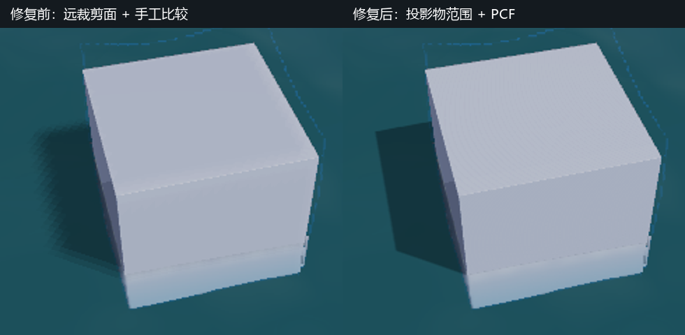

# P1-A 海面：Cube 阴影斑块排查

> 日期：2026-10-02；源码：当前未提交工作区。构建：`build-ci-msvc` Release。GPU：NVIDIA GeForce RTX 4060 Laptop GPU / 591.44 / OpenGL 3.3。

## 目标与范围

针对 `02_ocean_weather_hero.myscene` 中手动添加的 Cube 在水面旁产生的成片菱形暗斑，检查阴影生成、级联选择和水面采样。`25_ocean_cube_shadow.myscene` 保留相同海面设置、一个部分入水的 Cube 和固定机位，用于重复检查。用户截图没有记录 Cube 精确变换和相机姿态，因此夹具是同类问题复现，不是逐像素重放。

## 原因与修正

在开启阴影的原始夹具中，GPU 读回的三张级联深度图各有 `0` 个非清屏 texel。原因是阴影视图的包围范围把体积很大、却设置了 `castsShadow=false` 的海底板算作投影物，同时只取模型原始半径而忽略缩放。光源视图中心因此偏离 Cube；诊断时 Cube 中心在三个级联中的裁剪深度分别为 `-1.095`、`-1.039` 和 `-1.007`，均落在有效范围 `[-1,1]` 外。此时调高最终图像的 MSAA 不会生成缺失的阴影数据。

阴影范围现在仅由实际投影物的世界空间包围球确定：变换模型包围中心，半径乘模型矩阵三轴最大长度。级联远端依据相机到投影物的距离加四倍投影范围收紧，不再让海洋场景的 `1600` 单位相机远裁剪面稀释近处 Cube 阴影贴图。光源深度范围覆盖视锥前方的投影物；深度通道显式开启写入和 `GL_LESS`，并记录朝向光源的面，避免部分入水 Cube 的背面深度落在水面下方。

原采样器对深度值先做双线性插值，再逐点比较；这不是百分比更近过滤（PCF，percentage-closer filtering）。现在深度贴图启用硬件比较模式和线性过滤，Forward、Deferred 与水面统一执行 `3×3` PCF。前者修正空贴图和级联覆盖，后者处理阴影边缘的贴图采样锯齿；已开启的 `4× MSAA` 主要处理最终几何边缘，不能替代阴影图采样。该区别也见 [NVIDIA GPU Gems 的阴影抗锯齿章节](https://developer.nvidia.com/gpugems/gpugems/part-ii-lighting-and-shadows/chapter-11-shadow-map-antialiasing)。

## 截图

下图为相同 `1040×706` 机位与 `4× MSAA` 的前后对照。左侧是修正投影范围后仍用旧采样方式的阶梯暗边；右侧是收紧级联并使用硬件比较 PCF 后的连续阴影。图片只证明该夹具的暗边改善，不代表所有太阳角度都有物理软阴影。



## 验证

- `shadow-cascade-fitting` 与 `water-wave-synthesis`：`2/2` 通过。
- `gpu-smoke`、`shadow-cascade-acceptance`、`water-synthesis-acceptance`：均在上述 GPU 上退出码 `0`。
- 夹具的阴影 On/Off 截图分别成功导出；修复后开关会改变 Cube 左侧水面像素，旧实现的同场景开关画面曾逐像素一致。

## 限制与取舍

现有 `3×3` PCF 给出连续的采样边缘，但不是随光源角直径变化的真实半影；后续如需更柔和的阴影，可以针对水面单独提供质量档、接收面斜率偏置和更宽的 PCF/PCSS，并在斜阳与移动相机下测量成本与闪烁。非常长的投影可能越过按投影物范围收紧的最后一级联，需要另设远距离阴影策略。水下介质与接触泡沫问题仍按 [`ocean-underwater-boundaries.md`](ocean-underwater-boundaries.md) 继续处理。

## 复现命令

```powershell
$env:MYRENDERER_SMOKE_TEST='1'
$env:MYRENDERER_SCREENSHOT='build-ci-msvc/ocean-cube-shadow.png'
build-ci-msvc/Release/Iris.exe assets/scenes/fixtures/25_ocean_cube_shadow.myscene
Remove-Item Env:MYRENDERER_SMOKE_TEST,Env:MYRENDERER_SCREENSHOT
```

下一步按 [`../todolist.md`](../todolist.md) 的海面质量项，继续处理水下局部介质区间和近远网格层次；体积云思路另行调整。
