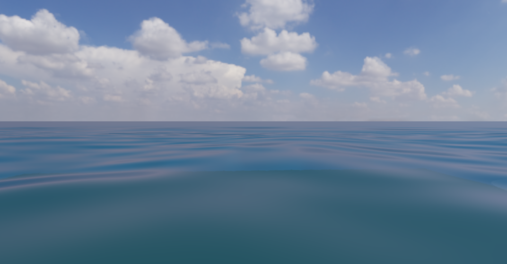

# P1-A 开放海域：现有天空盒与可调海面材质

> 日期：2026-10-02。源码：`6236c13` 基础上的当前工作区，尚未提交。
> 构建：`build-ci-msvc` Release、`build-mingw` Debug。
> GPU：NVIDIA GeForce RTX 4060 Laptop GPU；OpenGL 3.3.0 NVIDIA 591.44。

## 目标与范围

针对低视角海面截图中天空与水面之间的整片灰色背景，改用仓库已打包的 Poly Haven Kloofendal HDRI 作为开放海域场景的天空盒和水面反射源，延长可见海面，并提供可在 Inspector 中调节的海面材质。体积云算法保持原样；原有云海场景移入自动验收夹具。

## 实现

### 场景与资源

原相机远裁剪面为 `100` 世界单位；`waterExtent=500` 并不能让被裁掉的海面继续显示。`02_ocean_weather_hero.myscene` 现在显式保存 `farPlane=1600` 与 `waterExtent=2000`，并关闭解析大气和云，沿用现有 `EnvironmentMap` 加载的 Kloofendal 4K OpenEXR。该 HDRI 的来源、作者、校验值和 CC0 许可见 [`assets/environments/README.md`](../assets/environments/README.md)。镜面反射和背景取同一份环境贴图。开放海域仅保留深海床实体，以维持截图与场景交互入口；带礁石、体积云和海底的旧配置保存在 `assets/scenes/fixtures/23_ocean_clouds.myscene`，既有云影、光束和确定性作业改用该夹具。

调研了 [osgw](https://github.com/CaffeineViking/osgw) 的 MIT 许可 OpenGL Gerstner 海面实现。其整个渲染器依赖 OpenGL 4.1 Tessellation，不适合直接替换本项目的 OpenGL 3.3 管线；本次复用其中水面材质使用的 3D Simplex noise 源码作为两个尺度的细波法线，保留已有 Gerstner 几何、透射、阴影、TAA 与 Forward/Deferred 合成。源码与原作者许可分别在 `shaders/ocean_snoise.glsl`、`assets/licenses/osgw-MIT.txt` 和 `assets/licenses/ashima-webgl-noise-MIT.txt`。水体颜色与泡沫仍由现有程序化材质生成，不另引入一张固定颜色贴图。

### 材质与编辑器

细波只改变着色法线，不改变几何与运动矢量。此前两层细波在距相机 15～100 单位间同时淡出，使近景偏密、远景偏平。现在两层改为较宽的 `0.065` 与较细的 `0.28` 世界空间频率，分别根据片元的世界空间像素足迹（`fwidth`）逐级过滤：当某层波纹已无法由屏幕像素稳定分辨时才减弱，而较宽的波纹可继续延伸到中远景。这是屏幕空间抗锯齿近似，不会凭空增加远处几何细节。环境贴图的预滤波 mip 由 `waterRoughness` 控制；`waterReflectionStrength`、`waterRippleStrength`、`waterSunGlintStrength` 分别控制天空反射、细波扰动和定向光高光。四项均进入 `.myscene`、`EditorDomain`、`SetWaterSettings` 校验、Renderer uniform 与 Inspector 的 `Water surface` 分组；旧场景使用保持原有外观的默认值。`Camera` 分组提供 100～2000 的远裁剪距离，场景文件可逐项往返；旧场景未声明时仍为 100。原有 `Post processing` 分组已有 SSAO 开关、半径、偏移和强度，仍适用于 Deferred 的不透明物；它不作为海水材质自身的 AO 参数。

## 截图

同样是 1072×559 的开放海域画面，现有 HDRI 天空盒和延长的海面在地平线连续交接，没有用户截图中 125～175 行的整片纯色灰带；近景反射仍可通过材质滑块调整。



复现：使用下方固定时间命令生成 `build-ci-msvc/ocean-hdri-open.png`。原截图的 125～175 行中央区域 RGB 标准差为 `0/0/0`；本图同一区域为 `23.75/14.32/5.99`，仅用于佐证纯色带消失，不作为画质评分。

## 验证

- MSVC Release 与 MinGW Debug 完整构建通过；`ctest --test-dir build-ci-msvc -C Release --output-on-failure` 为 `26/26`。
- `scene-document-repeat-load` 验证新增材质参数、2000 范围内海面与相机远裁剪往返；`camera-navigation` 验证局部移动不修改远裁剪；`water-wave-synthesis` 保持原有 CPU/GPU 波浪合同。
- GPU screenshot 在 OpenGL 3.3、4×MSAA 下成功输出 1072×559 的开放海域画面；另用临时 `25°` 俯视机位检查近中景衔接，没有改动正式场景相机。`gpu-smoke`、`water-synthesis-acceptance` 与聚焦 `water-wave-synthesis` 均通过。原有云测试已改指向保留的云海夹具。

## 限制与取舍

此阶段改善地平线连续性、材质控制和细波的近远过渡，不声称达到照片级海面。四组 Gerstner 波仍会在中远景形成可辨认的周期结构；细波只改变法线。后续水下与接物边界排查已增加几何短波边长过滤、折射候选深度检查和未偏移接触泡沫，但仍不能用单张深度图重建遮挡后的物体；证据与分层网格方案见 [`ocean-underwater-boundaries.md`](ocean-underwater-boundaries.md)。没有 FFT 频谱、真实远海多尺度统计、稳定的屏幕空间或平面反射，也没有独立的水线折射 pass。更远的裁剪面降低传统深度缓冲的远处精度，主要供开放海域场景使用。HDRI 光源方向与手动方向光未自动反求一致；用户切换到解析大气后应重新检查定向高光。SSAO 仍不直接作用于透明海面，水面主要依靠深度透射、环境反射和阴影表现接触关系。

## 复现命令

```powershell
cmake --build build-ci-msvc --config Release --parallel 6
ctest --test-dir build-ci-msvc -C Release --output-on-failure
$env:MYRENDERER_SMOKE_TEST='1'
$env:MYRENDERER_SCREENSHOT='build-ci-msvc/ocean-hdri-open.png'
$env:MYRENDERER_RENDER_WIDTH='1072'
$env:MYRENDERER_RENDER_HEIGHT='559'
$env:MYRENDERER_ANIMATION_TIME='1.25'
$env:MYRENDERER_HIDE_SELECTION_OUTLINE='1'
build-ci-msvc/Release/MyRenderer.exe assets/scenes/02_ocean_weather_hero.myscene
```

## 下一步

继续 [`todolist.md`](../todolist.md) 的 P1-A 海面写实质量工作：多尺度波谱、微法线与粗糙度统一、稳定反射；体积云改造单独立项，不与本次海面修复混做。
