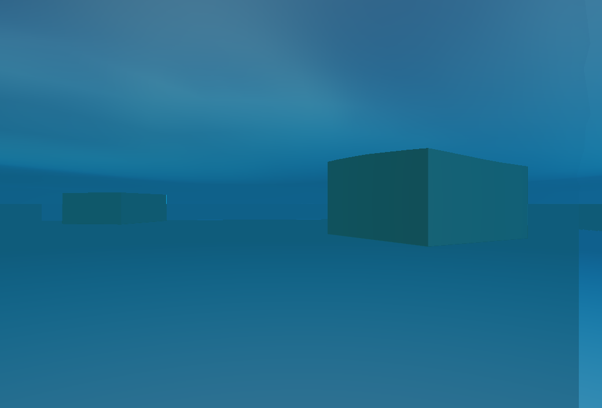

# P1-A 海面：水下与物体交界问题排查

> 日期：2026-10-02；源码：当前未提交工作区。构建：`build-ci-msvc` Release、`build-mingw` Debug。GPU：NVIDIA GeForce RTX 4060 Laptop GPU / 591.44 / OpenGL 3.3。

## 目标与范围

根据用户的水下视角与方块接水截图，排查海面的大块多边形、折射穿帮和白色碎片。使用同一渲染管线中的 `24_ocean_underwater_wide.myscene` 复现 2000 单位海面范围下的水下问题；近景接水另用 `21_ocean_depth.myscene` 的临时相机检查。未将两张用户截图当成精确相机基线。

## 实现与原因

### 水下透射与网格采样

水面着色器原先把无不透明物的天空深度当作 18 单位水体厚度；相机从水下看向水面时，眼睛到水面的路程已经由后处理水下雾负责，水面后方的天空属于空气。本次将该方向的水面后方水体厚度设为零，并用相机与当前水面片元的高度关系判定介质侧，避免仅凭斜率翻转造成误判。

更明显的大块折面来自几何采样：High 水面始终是 `192×192` 网格，旧场景范围为 `110`，开放海域为 `2000`，但仍在每个顶点计算 `15 / 7.5 / 3.4 / 1.6` 单位四组波。二次网格映射在距中心约 `100` 单位处，单格宽度约 `9.3` 单位，连 `15` 单位波都无法稳定表示。顶点着色器现在根据该顶点附近的网格边长平滑减弱不足 2～4 个采样点的短波，同时对当前位置、上一时刻位置、法线和速度使用相同权重。这遵循 [GPU Gems 的边长过滤原则](https://developer.nvidia.com/gpugems/gpugems/part-i-natural-effects/chapter-1-effective-water-simulation-physical-models)：网格无法承载的几何频率应被过滤，而非显示成更大的假波。

### 物体交界

旧着色器把折射后的深度同时用于水体吸收和接触泡沫。偏移的屏幕坐标跨过立方体轮廓时，可能把露出水面的侧面颜色拖入水下，并在错误位置触发浅水泡沫。本次把泡沫厚度改为未偏移的物体深度；折射候选点还要满足位于水面后方，且从上方看时不得落到露出水面的物体区域，否则退回未偏移采样。深度比较改为线性视空间距离。此处理与 [GPU Gems 3 的深度感知折射](https://developer.nvidia.com/gpugems/gpugems3/part-iii-rendering/chapter-19-deferred-shading-tabula-rasa)思路一致：需要区分被水覆盖的像素与高于水面的像素。

## 截图

同一 `1040×706`、固定 `1.25 s`、`waterExtent=2000` 的水下夹具中，滤波后水面上方的大三角形假波减少。水下仍偏平、颜色偏单一；这张图只证明采样伪影得到缓解。



复现：

```powershell
$env:MYRENDERER_SMOKE_TEST='1'
$env:MYRENDERER_SCREENSHOT='build-ci-msvc/ocean-underwater-wide-fixture.png'
$env:MYRENDERER_RENDER_WIDTH='1040'
$env:MYRENDERER_RENDER_HEIGHT='706'
$env:MYRENDERER_ANIMATION_TIME='1.25'
$env:MYRENDERER_TAA='0'
$env:MYRENDERER_BLOOM='0'
$env:MYRENDERER_HIDE_SELECTION_OUTLINE='1'
build-ci-msvc/Release/Iris.exe assets/scenes/fixtures/24_ocean_underwater_wide.myscene
```

## 验证

- `build-ci-msvc` Release 与 `build-mingw` Debug 构建成功；`water-synthesis-acceptance` 包含 Forward/Deferred、海床、泡沫、海况、水下、Low/High 与运动检查，最终退出码为零。
- `water-synthesis-benchmark` 在原有 `21_ocean_depth` 固定场景达到 High 折射阶段 GPU P95 `0.583 ms`、整帧 GPU P95 `2.623 ms`，均低于既定 `2 / 8 ms` 门槛；这不是 2000 单位宽海面的专项性能数据。
- 水下宽海面夹具、标准水下夹具、近距离立方体接水机位和正常海面机位均在真实 OpenGL 3.3 上截图并人工检查。
- 宽海面夹具从临时场景迁移到仓库内 `24_ocean_underwater_wide.myscene` 后，固定截图逐像素一致。

## 限制与后续方案

边长过滤会让远处细波更平，不能替代分层海面网格。完整方案应使用近景高密度环与远景低密度环，或相机相关的 clipmap，并让各尺度波浪与网格采样率匹配；海面与物体的接触还应先明确水面前后两种介质的深度区间，再生成窄范围的泡沫或湿边。当前折射仍只有不透明场景颜色与一层深度，无法重建被遮住的第二层表面或屏幕外内容。水下雾仍按相机处于水上/水下的全局布尔值切换，贴着波峰移动时可能突变；下一阶段应按局部水面高度和像素射线穿过水面的区间积分雾，并平滑处理相机穿水线。
